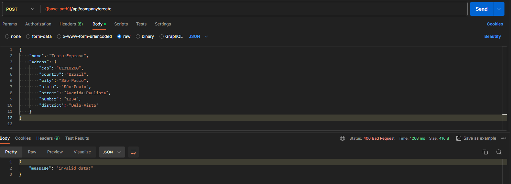
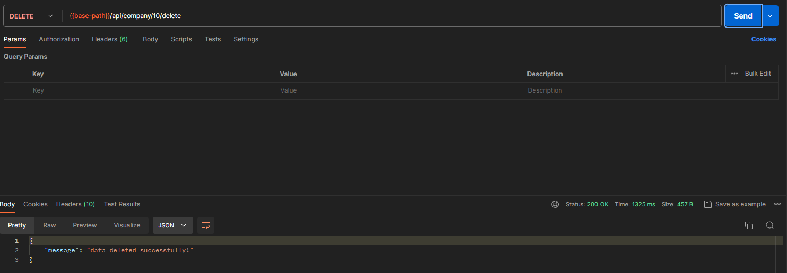
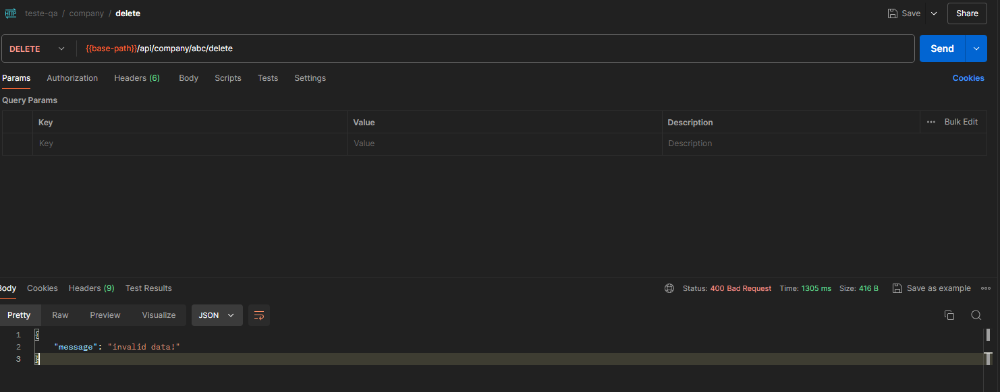

1 - Document Objectives
2 - Product Scope
3 - System Requirements
4 - Acceptance Criteria
5 - Test Cases
6 - Test Case Results
7 - Non-conformities
8 - Improvements

###### 1- Document Objectives
This document aims to identify the software components and requirements to be tested in the Contato Seguro CRUD project. In addition to identifying the system requirements, it will present the definition of acceptance criteria, detailed test cases, documentation, execution, results of the test cases, non-conformities and improvements.

###### 2- Product Scope
The Contato Seguro system will be subject to integration tests, functional tests, and end-to-end tests, where the Database, Front-End, and Back-End will be validated. In integration tests, API tests will be validated using the Postman framework, while end-to-end validations will be validated through automation in Cypress.

###### 3- System Requirements
- The system must allow the creation of new users with the mandatory fields: Nome, Email, Telefone, Data and Empresas. 
- The system must validate the formats in the fields Email, Telefone, Data. 
- The system must ensure that the Email and Telefone are unique. 
- The system must allow the viewing, updating, and deletion of users registered on the platform.

###### 4- Acceptance Criteria

- Successful registration: The user is successfully registered and a confirmation message is displayed.
- Successful registration with multiple companies: The user is successfully registered with multiple companies and a confirmation message is displayed.
- Name not filled in: The system displays an error message indicating that the name is required.
- Email not filled in: The system displays an error message indicating that the email is required.
- Invalid email format: The system displays an error message indicating that the email format is invalid.
- Duplicate email: The system displays an error message indicating that the email is already in use.
- Duplicate phone number: The system displays an error message indicating that the phone is already in use.
- Phone not filled in: The system displays an error message indicating that the phone is required.
- Invalid phone number format: The system displays an error message indicating that the phone format is invalid.
- Date not filled in: The system displays an error message indicating that the date is required.
- Future date: The system displays an error message indicating that the date is not valid.
- Company not selected: The system displays an error message indicating that the company is required.
- View created user: The user details are correctly displayed.
- User Update without name: The system displays an error message indicating that the name is required.
- User Update without email: The system displays an error message indicating that the email is required.
- User Update with invalid email format: The system displays an error message indicating that the email format is invalid.
- User Update with duplicate email: The system displays an error message indicating that the email is already in use.
- User Update without phone number: The system displays an error message indicating that the phone is required.
- User Update with invalid phone: The system displays an error message indicating that the phone format is invalid.
- User Update without date: The system displays an error message indicating that the date is required.
- User Update without company: The system displays an error message indicating that the company is required.
- Delete user registration: The registration is successfully removed and a confirmation message is displayed.
- Successfully create a new user via API: The user is successfully created via API and a success message is displayed.
- Create new user via API Bad Request: The user is not created and a Bad Request error message is returned from the API.
- Successfully view a user by ID via API: The API returns the data of the user searched by ID and a success message is displayed.
- View a user by ID via API Bad Request: The user cannot be viewed and a Bad Request error message is returned from the API.
- Successfully view all users via API: The API returns the data of all users and a success message is displayed.
- Successfullly view a user by ID: The API returns the data of a user and a success message is displayed.
- View a user by ID via API Bad Request: The API returns a Bad Request error message.
- Successfully update a user via API: The API updates the user data and a success message is displayed.
- Update user via API Bad Request: The user cannot be updated and a Bad Request error message is returned from the API.
- Successfullly delete a user via API: The API deletes the user data and a success message is displayed.
- Delete user not found via API: The API returns a 404 Not Found error message.
- Successfully create a new company via API: The company is successfully created via API and a success message is displayed.
- Create company via API Bad Request: The company cannot be created and a Bad Request error message is returned from the API.
- Successfully view all companies via API: The API returns the data of all companies and a success message is displayed.
- Successfully view a company by ID via API: The API returns the data of the company searched by ID and a success message is displayed.
- View a company by ID API Bad Request: The API does not return the company data and displays a Bad Request message.
- Successfully update a company via API: The API updates the company data and a success message is displayed.
- Update company via API Bad Request: The API does not update the company data and displays a Bad Request message.
- Successfully delete a company via API: The API deletes the company data and a success message is displayed.
- Delete company via API Bad Request: The API does not delete the company data and a Bad Request message is returned.

###### 5- Test Cases

User Story:
As an administrator of the Contato Seguro system
I want to manage user accounts
So that I can ensure user information is up-to-date for the companies

Feature: Register User

#1 Scenario: Successful User Registration
    Given the administrator is on the main page of the Contato Seguro system
    And selects the "+Novo Usuário " button
    When they fill in the "Nome" field with a valid name
    And they fill in the "E-mail" field with a valid email
    And they fill in the "Telefone" field with an area code and number
    And they fill in the "Data" field with a valid date
    And they select the desired company in the "Empresas" field
    And they click the modal to close the dropdown menu
    And they select the "Salvar" button
    Then it should be possible to view the registered user on the main page

#2 Scenario: Successful User Registration multiple Companies
    Given the administrator is on the main page of the Contato Seguro system
    And selects the "+Novo Usuário " button
    When they fill in the "Nome" field with a valid name
    And they fill in the "E-mail" field with a valid email
    And they fill in the "Telefone" field with an area code and number
    And they fill in the "Data" field with a valid date
    And they select the desired company in the "Empresas" field
    And they select another company in the "Empresas" field
    And they click the modal to close the dropdown menu
    And they select the "Salvar" button
    Then it should be possible to view the registered user on the main page

#3 Scenario: Name Not Filled In
    Given the administrator is on the main page of the Contato Seguro system
    And they select the "+Novo Usuário" button
    When they leave the "Nome" field empty
    And they fill in the "E-mail" field with a valid email
    And they fill in the "Telefone" field with an area code and number
    And they fill in the "Data" field with a valid date
    And they select the desired company in the "Empresas" field
    And they click the modal to close the dropdown menu
    And they select the "Salvar" button
    Then the system should alert the mandatory "Nome" field
    And display a message requesting the empty field to be filled in

#4 Scenario: Email Not Filled In
    Given the administrator is on the main page of the Contato Seguro system
    And they select the "+Novo Usuário" button
    When they fill in the "Nome" field with a valid name
    And they leave the "E-mail" field empty
    And they fill in the "Telefone" field with an area code and number
    And they fill in the "Data" field with a valid date
    And they select the desired company in the "Empresas" field
    And they click the modal to close the dropdown menu
    And they select the "Salvar" button
    Then the system should alert the mandatory "E-mail" field
    And display a message requesting the empty field to be filled in

#5 Scenario: Invalid Email Format
    Given the administrator is on the main page of the Contato Seguro system
    And they select the "+Novo Usuário" button
    When they fill in the "Nome" field with a valid name
    And they fill in the "E-mail" field with an invalid format
    And they fill in the "Telefone" field with an area code and number
    And they fill in the "Data" field with a valid date
    And they select the desired company in the "Empresas" field
    And they click the modal to close the dropdown menu
    And they select the "Salvar" button
    Then the system should alert an error about the value in the "E-mail" field
    And display a message requesting the field to be filled in with a correct value

#6 Scenario: Duplicate Email
    Given the administrator is on the main page of the Contato Seguro system
    And they select the "+Novo Usuário" button
    When they fill in the "Nome" field with a valid name
    And they fill in the "E-mail" field with a previously registered email
    And they fill in the "Telefone" field with an area code and number
    And they fill in the "Data" field with a valid date
    And they select the desired company in the "Empresas" field
    And they click the modal to close the dropdown menu
    And they select the "Salvar" button
    Then the system should alert an error about the value in the "E-mail" field
    And display a message requesting the field to be changed to a correct value

#7 Scenario: Phone Number Not Filled In
    Given the administrator is on the main page of the Contato Seguro system
    And they select the "+Novo Usuário" button
    When they fill in the "Nome" field with a valid name
    And they fill in the "E-mail" field with a valid email
    And they leave the "Telefone" field empty
    And they fill in the "Data" field with a valid date
    And they select the desired company in the "Empresas" field
    And they click the modal to close the dropdown menu
    And they select the "Salvar" button
    Then the system should alert the mandatory "Telefone" field
    And display a message requesting the empty field to be filled in

#8 Scenario: Invalid Phone Number Format
    Given the administrator is on the main page of the Contato Seguro system
    And they select the "+Novo Usuário" button
    When they fill in the "Nome" field with a valid name
    And they fill in the "E-mail" field with a valid email
    And they fill in the "Telefone" field with an invalid format
    And they fill in the "Data" field with a valid date
    And they select the desired company in the "Empresas" field
    And they click the modal to close the dropdown menu
    And they select the "Salvar" button
    Then the system should alert an error about the value in the "Telefone" field
    And display a message requesting the field to be changed to a correct value

#9 Scenario: Duplicate Phone Number
    Given the administrator is on the main page of the Contato Seguro system
    And they select the "+Novo Usuário" button
    When they fill in the "Nome" field with a valid name
    And they fill in the "E-mail" field with a valid email
    And they fill in the "Telefone" field with a previously registered phone number
    And they fill in the "Data" field with a valid date
    And they select the desired company in the "Empresas" field
    And they click the modal to close the dropdown menu
    And they select the "Salvar" button
    Then the system should alert an error about the value in the "Telefone" field
    And display a message requesting the field to be changed to a correct value

#10 Scenario: Date Not Filled In
    Given the administrator is on the main page of the Contato Seguro system
    And they select the "+Novo Usuário" button
    When they fill in the "Nome" field with a valid name
    And they fill in the "E-mail" field with a valid email
    And they fill in the "Telefone" field with an area code and number
    And they leave the "Data" field empty
    And they select the desired company in the "Empresas" field
    And they click the modal to close the dropdown menu
    And they select the "Salvar" button
    Then the system should alert the mandatory "Data" field
    And display a message requesting the empty field to be filled in

#11 Scenario: Future Date
    Given the administrator is on the main page of the Contato Seguro system
    And they select the "+Novo Usuário" button
    When they fill in the "Nome" field with a valid name
    And they fill in the "E-mail" field with a valid email
    And they fill in the "Telefone" field with an area code and number
    And they fill in the "Data" field with a future date
    And they select the desired company in the "Empresas" field
    And they click the modal to close the dropdown menu
    And they select the "Salvar" button
    Then the system should alert an error about the value in the "Data" field
    And display a message requesting the field to be changed to a correct value

#12 Scenario: Company Not Selected
    Given the administrator is on the main page of the Contato Seguro system
    And they select the "+Novo Usuário" button
    When they fill in the "Nome" field with a valid name
    And they fill in the "E-mail" field with a valid email
    And they fill in the "Telefone" field with an area code and number
    And they fill in the "Data" field with a valid date
    And they leave the "Empresas" field empty
    And they click the modal to close the dropdown menu
    And they select the "Salvar" button
    Then the system should alert the mandatory "Empresas" field
    And display a message requesting the empty field to be filled in

Feature: View User

#13 Scenario: View Created User
    Given the administrator is on the main page of the Contato Seguro system
    And they view the list of users
    Then it should be possible to view the data of the registered user

Feature: Update User

#14 Scenario: User Update
    Given the administrator is on the main page of the Contato Seguro system
    And they select the "Editar Usuário" button
    When they change the "Nome" field to a valid name
    And they change the "E-mail" field to a valid email
    And they change the "Telefone" field to an area code and number
    And they change the "Data" field to a valid date
    And they change the "Empresas" field to a valid company
    And they select the "Salvar" button
    Then it should be possible to view the updated user on the main page

#15 Scenario: User Update Without Name
    Given the administrator is on the main page of the Contato Seguro system
    And they select the "Editar Usuário" button
    When they change the "Nome" field to an empty value
    And they change the "E-mail" field to a valid email
    And they change the "Telefone" field to an area code and number
    And they change the "Data" field to a valid date
    And they change the "Empresas" field to a valid company
    And they select the "Salvar" button
    Then the system should alert the mandatory "Nome" field
    And display a message requesting the empty field to be filled in

#16 Scenario: User Update Without Email
    Given the administrator is on the main page of the Contato Seguro system
    And they select the "Editar Usuário" button
    When they change the "Nome" field to a valid name
    And they change the "E-mail" field to an empty value
    And they change the "Telefone" field to an area code and number
    And they change the "Data" field to a valid date
    And they change the "Empresas" field to a valid company
    And they select the "Salvar" button
    Then the system should alert the mandatory "E-mail" field
    And display a message requesting the empty field to be filled in

#17 Scenario: User Update with Invalid Email Format
    Given the administrator is on the main page of the Contato Seguro system
    And they select the "Editar Usuário" button
    When they change the "Nome" field to a valid name
    And they change the "E-mail" field to an invalid format
    And they change the "Telefone" field to an area code and number
    And they change the "Data" field to a valid date
    And they change the "Empresas" field to a valid company
    And they select the "Salvar" button
    Then the system should alert the mandatory "E-mail" field
    And display a message requesting the field to be changed to a correct value

#18 Scenario: User Update With Duplicate Email
    Given the administrator is on the main page of the Contato Seguro system
    And they select the "Editar Usuário" button
    When they change the "Nome" field to a valid name
    And they change the "E-mail" field to a previously registered email
    And they change the "Telefone" field to an area code and number
    And they change the "Data" field to a valid date
    And they change the "Empresas" field to a valid company
    And they select the "Salvar" button
    Then the system should alert about the duplicate entry in the "E-mail" field
    And display a message requesting the field to be changed to a unique value

#19 Scenario: User Update Without Phone Number
    Given the administrator is on the main page of the Contato Seguro system
    And they select the "Editar Usuário" button
    When they change the "Nome" field to a valid name
    And they change the "E-mail" field to a valid email
    And they change the "Telefone" field to an empty value
    And they change the "Data" field to a valid date
    And they change the "Empresas" field to a valid company
    And they select the "Salvar" button
    Then the system should alert the mandatory "Telefone" field
    And display a message requesting the empty field to be filled in

#20 Scenario: User Update With Invalid Phone Number Format
    Given the administrator is on the main page of the Contato Seguro system
    And they select the "Editar Usuário" button
    When they change the "Nome" field to a valid name
    And they change the "E-mail" field to a valid email
    And they change the "Telefone" field to an invalid format
    And they change the "Data" field to a valid date
    And they change the "Empresas" field to a valid company
    And they select the "Salvar" button
    Then the system should alert an error about the value in the "Telefone" field
    And display a message requesting the field to be changed to a correct value

#21 Scenario: User Update Without Date
    Given the administrator is on the main page of the Contato Seguro system
    And they select the "Editar Usuário" button
    When they change the "Nome" field to a valid name
    And they change the "E-mail" field to a valid email
    And they change the "Telefone" field to an area code and number
    And they change the "Data" field to an empty value
    And they change the "Empresas" field to a valid company
    And they select the "Salvar" button
    Then the system should alert the mandatory "Data" field
    And display a message requesting the empty field to be filled in

#22 Scenario: User Update Without Company
    Given the administrator is on the main page of the Contato Seguro system
    And they select the "Editar Usuário" button
    When they change the "Nome" field to a valid name
    And they change the "E-mail" field to a valid email
    And they change the "Telefone" field to an area code and number
    And they change the "Data" field to a valid date
    And they change the "Empresas" field to an empty value
    And they select the "Salvar" button
    Then the system should alert the mandatory "Empresas" field
    And display a message requesting the empty field to be filled in

Feature: Delete User

#23 Scenario: Delete User Registration
    Given the administrator is on the main page of the Contato Seguro system
    And they select the "Excluir" button for the user
    Then the system should alert the successful deletion
    And display a message stating "Success! User deleted successfully!"

#API User
Feature: Create a new user via API

#24 Scenario: Successfully create a new user via API
    Given the API endpoint 'http://localhost:8400/api/user/create' is available
    When a POST request is sent to the endpoint with the following JSON payload:
      """
      {
        "name": "<nome>",
        "email": "<email>",
        "companies": ["<company.id>"],
        "telephone": "<telephone>"
        "birth_date": "<yyyy/mm/dd>"
      }
      """
    And the request header 'Content-Type' is set to 'application/json'
    Then the response status code should be 200
    And the response body should contain the user's details with "name" as "<name>", "email" as "<email>", "companies" containing "<company.id>", "telephone" containing "<telephone>" and "birth_date" containing "<yyyy/mm/dd>"

#Examples:
        | nome                | email                       |company.id | telephone    | birth date
        | Lucas Engelmann     | lucasengelman@email.com     | 1         | 51985696919  | 1998/01/01
        | João Silva          | joaosilva@email.com         | 4         | 11999182121  | 2000/07/03

#25 Scenario: Create new user via API Bad Request
    Given the API endpoint 'http://localhost:8400/api/user/create' is available
    When a POST request is sent to the endpoint with the following JSON payload:
      """
      {
        "name": "<nome>",
        "email": "<email>",
        "telephone": "<telephone>"
        "birth_date": "<yyyy/mm/dd>"
      }
      """
    And the request header 'Content-Type' is set to 'application/json'
    Then the response status code should be 400
    And the response body should contain a message explaining "{"message": "invalid data!"}"

#Examples:
        | nome                | email                       | telephone    | birth date
        | Lucas Engelmann     | lucasengelman@email.com     | 51985696919  | 1998/01/01
        | João Silva          | joaosilva@email.com         | 11999182121  | 2000/07/03
        
Feature: View all users via API

#26 Scenario: Successfully view all users via API
    Given the API endpoint 'http://localhost:8400/api/user' is available
    When a GET request is sent to the endpoint
    Then the response status code should be 200 with the user data
    And the response body should contain a list of users
    And each user in the list should have the fields "id_user", "name", "email", "telephone", "birth_date", "birth_city", "show" and "companies"

Feature: View a user by ID via API

#27 Scenario: Successfully View a user by ID
    Given the API endpoint 'http://localhost:8400/api/user/{id}' is available
    And a user with ID "<id_user>" exists in the system
    When a GET request is sent to the endpoint with the user ID "<id_user>"
    Then the response status code should be 200
    And the response body should contain the user's details with "id" as "<id_user>"

#Examples: after retrieving all users, if a user has an id_user as:
    | id_user |
    | 33      |    

#28 Scenario: View a user by ID via API Bad Request
    Given the API endpoint 'http://localhost:8400/api/user/{id}' is available
    And a user with ID "<id_user>" exists in the system
    When a GET request is sent to the endpoint with the user ID "<id_user>"
    Then the response status code should be 400
    And the response body should contain a message explaining "{"message": "invalid data!"}"

#Examples: after retrieving all users, if using invalid format id:
    | id_user |
    | 00      | 

Feature: Update a user via API

#29 Scenario: Successfully update a user via API
    Given the API endpoint 'http://localhost:8400/api/user/{id}/update' is available
    And a user with ID "<id_user>" exists in the system
    When a PATCH request is sent to the endpoint with the user ID "<id_user>" and the following JSON payload:
      """
      {
        "name": "<nome>",
        "email": "<email>",
        "companies": ["<company.id>"]
      }
      """
    And the request header 'Content-Type' is set to 'application/json'
    Then the response status code should be 200: Updated user data
    And the response body should contain the updated user's details with "name" as "<nome>", "email" as ""<email>", and "companies" containing ["<company.id>"]

#Examples:
 http://localhost:8400/api/user/33/update
    |name            | email                    |company.id
    |Lucas Engelmann | lucasengelman@gmail.com  | 4

#30 Scenario: Update user via API Bad Request
    Given the API endpoint 'http://localhost:8400/api/user/{<id_user>}/update' is available
    And a user with ID "<id_user>" exists in the system
    When a PATCH request is sent to the endpoint with the user ID "<id_user>" and the following JSON payload:
      """
      {
        "name": "<nome>",
        "email": "<email>",
        "companies": ["null"]
      }
      """
    And the request header 'Content-Type' is set to 'application/json'
    Then the response status code should be 400: Bad Request

    #Examples:
 http://localhost:8400/api/user/33/update
    |name            | email                    |company.id | id_user
    |Lucas Engelmann | lucasengelman@gmail.com  | null      | 33

#31 Scenario: Successfully delete a user via API
    Given the API endpoint 'http://localhost:8400/api/user/{id_user}/delete' is available
    And a user with ID "<id_user>" exists in the system
    When a DELETE request is sent to the endpoint with the user ID "<id_user>"
    Then the user should be successfully deleted
    And the response status should be 200
    And the response message should be "data deleted successfully!"

#32 Scenario: Delete user not found via API
    Given the API endpoint 'http://localhost:8400/api/user/{id_user}/delete' is available
    And a user with ID "<id_user>" does not exist in the system
    When a DELETE request is sent to the endpoint with the user ID "<id_user>"
    Then the user should not be found
    And the response status should be 404
    And the response message should be "unable to delete data!"

#API Company

Feature: Create a new company via API

#33 Scenario: Successfully create a new company via API
    Given the API endpoint 'http://localhost:8400/api/company/create' is available
    When a POST request is sent to the endpoint with the following JSON payload:
      """
      {
    "name": "<name>">,
    "cnpj": "<cnpj>",
    "adress": {
        "cep": "<cep>",
        "country": "<country>",
        "city": "<city>",
        "state": "<state>",
        "street": "<street>",
        "number": "<number>",
        "district": "<district>"
    }
}
      """
    And the request header 'Content-Type' is set to 'application/json'
    Then the response status code should be 201: Created company data
    And the response body should contain the company's details with "name" as "<name>", "cnpj" as "<cnpj>", and "adress"
    And each "adress" should contain "cep" as "<cep>", "country" as "<country>", "city" as "<city>", "street" "<street>", "number" as "<number>", and "district" as "<district>"

    #Examples
    |name            |cnpj              |cep        |country   |city       |state      | street           | number |district
    |Teste Empresa   |71963761000197    |01310200   |Brazil    |São Paulo  |São Paulo  | Avenida Paulista | 1234   |Bela Vista

#34 Scenario: Create a new company 400 via API Bad Request    
    Given the API endpoint 'http://localhost:8400/api/company/create' is available
    When a POST request is sent to the endpoint with the following JSON payload:
      """
      {
    "name": "<name>",
    "adress": {
        "cep": "<cep>",
        "country": "<country>",
        "city": "<city>",
        "state": "<state>",
        "street": "<street>",
        "number": "<number>",
        "district": "<district>"
    }
}
      """
    And the request header 'Content-Type' is set to 'application/json'
    Then the response status code should be 400: Bad Request
    And the response body should alert {"message": "invalid data!"}

    #Examples
    |name            |cep        |country   |city       |state      | street            |number |district
    |Teste Empresa   |01310200   |Brazil    |São Paulo  |São Paulo  | Avenida Paulista  |1234   |Bela Vista

Feature: View all companies via API

#35 Scenario: Successfully View all companies
    Given the API endpoint 'http://localhost:8400/api/company' is available
    When a GET request is sent to the endpoint
    Then the response status code should be 200
    And the response body should contain a list of companies
    And each company in the list should have the fields "id", "name", "cnpj", and "adress"
    And each "adress" should contain "cep", "country", "city", "street", "number", and "district"

Feature: View a company by ID via API

#36 Scenario: Successfully view a company by ID via API
    Given the API endpoint 'http://localhost:8400/api/company/{id}' is available
    And a company with ID "<id_company>" exists in the system
    When a GET request is sent to the endpoint with the company ID "<id_company>"
    Then the response status code should be 200 with the company data
    And the response body should contain the company's details with "id" as "<id_company>", "name", "cnpj", and "adress"
    And the "adress" should contain "cep", "country", "city", "street", "number", and "district"

#37 Scenario: View a company by ID via API Bad Request
    Given the API endpoint 'http://localhost:8400/api/company/{id}' is available
    And a company with ID "<id_company>" exists in the system
    When a GET request is sent to the endpoint with the company ID "<id_company>"
    Then the response status code should be 400: Bad request
    And the response body should contain {"message": "invalid data!"}

#Examples: after retrieving all users, if using a invalid format id:
    | id_company |
    | 00         | 

Feature: Update a company via API

#38 Scenario: Successfully update a company via API
    Given the API endpoint 'http://localhost:8400/api/company/{id}/update' is available
    And a company with ID "<id_company>" exists in the system
    When a PATCH request is sent to the endpoint with the company ID "<id_company>" and the following JSON payload:
      """
      {
    "name": "<name>">,
    "cnpj": "<cnpj>",
    "adress": {
        "cep": "<cep>",
        "country": "<country>",
        "city": "<city>",
        "state": "<state>",
        "street": "<street>",
        "number": "<number>",
        "district": "<district>"
        }
      }
      """
    And the request header 'Content-Type' is set to 'application/json'
    Then the response status code should be 200: Updated company data
    And the response body should contain the updated company's details with "name" as "<name>", "cnpj" as "<cnpj>", and "adress" containing "<cep>", "<country>", "<state>", "<city>", "<street>", "<number>", and "<district>"

#Examples
    |name                |cnpj              |cep        |country   |city       |state      |number |district
    |Atualiza Empresa   |54300998000179    |01310200   |Brazil    |São Paulo  |São Paulo  |1344   |Bela Vista

#39 Scenario: Update company via API Bad Request
    Given the API endpoint 'http://localhost:8400/api/company/{id}/update' is available
    And a ID "<id_company>" is an invalid ID
    When a PATCH request is sent to the endpoint with the invalid company ID "<id_company>" and the following JSON payload:
      """
      {
    "name": "<name>">,
    "cnpj": "<cnpj>",
    "adress": {
        "cep": "<cep>",
        "country": "<country>",
        "city": "<city>",
        "state": "<state>",
        "street": "<street>",
        "number": "<number>",
        "district": "<district>"
        }
      }
      """
    And the request header 'Content-Type' is set to 'application/json'
    Then the response status code should be 400: Bad Request
    And the response body should contain {"message": "invalid data!"}

#Examples
    |name                |cnpj              |cep        |country   |city       |state      |number |district
    |Atualiza Empresa   |54300998000179    |01310200   |Brazil    |São Paulo  |São Paulo  |1344   |Bela Vista

#40 Scenario: Successfully delete a company via API
    Given I have a company with ID "<id_company>"
    When I send a DELETE request to 'http://localhost:8400/api/company/{id}/delete'
    Then the company should be deleted successfully
    And I should receive a 200 status code

#41 Scenario: Delete a company via API Bad Request
    Given I have an invalid company ID '<invalid_id_company>'
    When I send a DELETE request to 'http://localhost:8400/api/company/<invalid_id_company>/delete'
    Then I should receive a 400 status code
    And the response should indicate an invalid data

#Examples
| invalid company id |
| abc                |

###### 6- Test Case Results

Feature: Register user

Test Case ID: TC0001
Title: Successful User Registration
Description: Validate if a new user can be successfully registered in the system.
Pre-condition: The system must be accessible and the registration page must be open.
Steps:
    Given that the administrator is on the main page of the Contato Seguro system
    And selects the "+Novo Usuário" button
    When filling in the "Nome" field with a valid name
    And filling in the "E-mail" field with a valid email
    And filling in the "Telefone" field with a DDD and number
    And filling in the "Data" field with a valid date
    And selecting the desired company in the "Empresas" field
    And clicking the modal to close the dropdown menu
    And selecting the "Salvar" button
Expected result: Then it should be possible to view the registered user on the main page.
Post-condition: The new user should be available for consultation on the main page.
Method used: Automated test via Cypress
Actual result: Registration successfully completed 

Test Case ID: TC0002
Title: Successful User Registration multiple Companies
Description: Validate if a new user can be successfully registered in the system using multiple companies.
Pre-condition: The system must be accessible and the registration page must be open.
Steps:
    Given that the administrator is on the main page of the Contato Seguro system
    And selects the "+Novo Usuário" button
    When filling in the "Nome" field with a valid name
    And filling in the "E-mail" field with a valid email
    And filling in the "Telefone" field with a DDD and number
    And filling in the "Data" field with a valid date
    And selecting the desired company in the "Empresas" field
    And selecting another company in the "Empresas" field
    And clicking the modal to close the dropdown menu
    And selecting the "Salvar" button
Expected result: 
    Then it should be possible to view the registered user on the main page.
Post-condition: The new user should be available for consultation on the main page.
Method used: Automated test via Cypress
Actual result: Registration successfully completed 

Test Case ID: TC0003
Title: Name Not Filled In
Description: Validate if a user can be registered without filling in the required "Nome" field.
Pre-condition: The system must be accessible and the registration page must be open.
Steps:
    Given that the administrator is on the main page of the Contato Seguro system
    And selects the "+Novo Usuário" button
    When the "Nome" field is left empty
    And filling in the "E-mail" field with a valid email
    And filling in the "Telefone" field with a DDD and number
    And filling in the "Data" field with a valid date
    And selecting the desired company in the "Empresas" field
    And clicking the modal to close the dropdown menu
    And selecting the "Salvar" button
Expected result:
    Then the system should alert the mandatory "Nome" field
    And present a message requesting the completion of the empty field.
Post-condition: It should not be possible to register the new user.
Method used: Automated test via Cypress
Actual result: System alerted the need to fill the mandatory "Nome" field and presented a message requesting its completion 

Test Case ID: TC0004
Title: Email Not Filled In
Description: Validate if a user can be registered without filling in the required "E-mail" field.
Pre-condition: The system must be accessible and the registration page must be open.
Steps:
    Given that the administrator is on the main page of the Contato Seguro system
    And selects the "+Novo Usuário" button
    When filling in the "Nome" field with a valid name
    And leaving the "E-mail" field empty
    And filling in the "Telefone" field with a DDD and number
    And filling in the "Data" field with a valid date
    And selecting the desired company in the "Empresas" field
    And clicking the modal to close the dropdown menu
    And selecting the "Salvar" button
Expected result:
    Then the system should alert the mandatory "E-mail" field
    And present a message requesting the completion of the empty field.
Post-condition: It should not be possible to register the new user.
Method used: Automated test via Cypress
Actual result: System alerted the need to fill the mandatory "Email" field and presented a message requesting its completion 

Test Case ID: TC0005
Title: Invalid Email Format
Description: Validate if a user can be registered with an incorrectly formatted "E-mail" field.
Pre-condition: The system must be accessible, and the registration page must be open.
Steps:
    Given that the administrator is on the main page of the Contato Seguro system
    And selects the "+ Novo Usuário" button
    When filling the "Nome" field with a valid name
    And fills the "E-mail" field with an invalid format
    And fills the "Telefone" field with a valid phone number
    And fills the "Data" field with a valid date
    And selects the desired company in the "Empresas" field
    And clicks on the modal to close the dropdown menu
    And selects the "Salvar" button
Expected Result:
    Then the system should alert an error regarding the value in the "E-mail" field
    And present a message requesting the correct value to be entered in the field.
Post-condition: It should not be possible to register the new user.
Actual Result: The test could not be automated due to the absence of an email format validation rule in the code, as it accepts any string without verifying the entered format.

Test Case ID: TC0006
Title: Duplicate Email
Description: Validate if a user can be registered with an email that has been previously used.
Pre-condition: Have a user previously created with the email used.
Steps:
    Given that the administrator is on the main page of the Contato Seguro system
    And selects the "+ Novo Usuário" button
    When filling the "Nome" field with a valid name
    And fills the "E-mail" field with a previously registered email
    And fills the "Telefone" field with a valid phone number
    And fills the "Data" field with a valid date
    And selects the desired company in the "Empresas" field
    And clicks on the modal to close the dropdown menu
    And selects the "Salvar" button
Expected Result:
    Then the system should alert an error regarding the value in the "E-mail" field
    And present a message requesting the change of the field with the correct value.
Post-condition: It should not be possible to register the new user.
Actual Result: The test could not be automated due to the absence of a validation rule for registered emails in the system, as it accepts any string without verifying the format entered.

Test Case ID: TC0007
Title: Phone Number Not Filled In
Description: Validate if a user can be registered without filling in the required "Telefone" field.
Pre-condition: The system must be accessible and the registration page must be open.
Steps:
    Given that the administrator is on the main page of the Contato Seguro system
    And selects the "+ Novo Usuário" button
    When filling in the "Nome" field with a valid name
    And filling in the "E-mail" field with a valid email
    And leaving the "Telefone" field empty
    And filling in the "Data" field with a valid date
    And selecting the desired company in the "Empresas" field
    And clicking the modal to close the dropdown menu
    And selecting the "Salvar" button
Expected result:
    Then the system should alert the mandatory "Telefone" field
    And present a message requesting the completion of the empty field.
Post-condition: It should not be possible to register the new user.
Actual result: Bug NCTC0007- The scenario couldn't be automated due to the absence of the 'Telefone' field as a mandatory requirement in the code, despite being documented as mandatory. When attempting to create a new user without providing the phone number, it allows the creation to proceed.

Test Case ID: TC0008
Title: Invalid Phone Number Format
Description: Validate if a user can be registered with an incorrect format in the mandatory field "Phone Number".
Pre-condition: The system must be accessible and the registration page must be open.
Steps:
    Given that the administrator is on the main page of the Contato Seguro system
    And selects the "+ Novo Usuário" button
    When filling the "Nome" field with a valid name
    And fills the "E-mail" field with a valid email
    And fills the "Telefone" field with an invalid format
    And fills the "Data" field with a valid date
    And selects the desired company in the "Empresas" field
    And clicks on the modal to close the dropdown menu
    And selects the "Salvar" button
Expected Result:
    Then the system should alert an error regarding the value in the "Telefone" field
    And present a message requesting the change of the field with the correct value.
Post-condition: It should not be possible to register the new user.
Actual Result: The test could not be executed due to the impact of Bug NCCT0007.

Test Case ID TC0009 
Title: Duplicate Phone Number
Description: Validate if a user can be registered with a "Telefone" that has been previously used.
Pre-condition: The system must be accessible and the registration page must be open.
Steps:
    Given that the administrator is on the main page of the Contato Seguro system
    And selects the "+ Novo Usuário" button
    When filling the "Nome" field with a valid name
    And fills the "E-mail" field with a valid email
    And fills the "Telefone" field with a previously registered phone number
    And fills the "Data" field with a valid date
    And selects the desired company in the "Empresas" field
    And clicks on the modal to close the dropdown menu
    And selects the "Salvar" button
Expected Result:
    Then the system should alert an error regarding the value in the "Telefone" field
    And present a message requesting the change of the field with the correct value.
Post-condition: It should not be possible to register the new user.
Actual Result: The test could not be executed due to the impact of Bug NCCT0007.

Test Case ID: TC0010
Title: Date Not Filled In
Description: Validate if a user can be registered without filling the mandatory "Data" field.
Pre-condition: The system must be accessible and the registration page must be open.
Steps:
    Given that the administrator is on the main page of the Contato Seguro system
    And selects the "+ Novo Usuário" button
    When filling the "Nome" field with a valid name
    And fills the "E-mail" field with a valid email
    And fills the "Telefone" field with a DDD and number
    And leaves the "Data" field empty
    And selects the desired company in the "Empresas" field
    And clicks on the modal to close the dropdown menu
    And selects the "Salvar" button
Expected Result:
    Then the system should alert the requirement of the "Data" field
    And present a message requesting the completion of the empty field.
    Post-condition: It should not be possible to register the new user.
Method used: Automated test via Cypress
Actual Result: The system alerted the need to fill the mandatory "Data" field and presented a message requesting its completion. 

Test Case ID: TC0011
Title: Future Date
Description: Validate if a user can be registered with a future date.
Pre-condition: The system must be accessible and the registration page must be open.
Steps:
    Given that the administrator is on the main page of the Contato Seguro system
    And selects the "+ Novo Usuário" button
    When filling the "Nome" field with a valid name
    And fills the "E-mail" field with a valid email
    And fills the "Telefone" field with a DDD and number
    And fills the "Data" field with a future date
    And selects the desired company in the "Empresas" field
    And clicks on the modal to close the dropdown menu
    And selects the "Salvar" button
Expected Result:
    Then the system should alert an error regarding the value in the "Data" field
    And present a message requesting the correction of the field with the correct value.
Post-condition: It should not be possible to register the new user.
Actual Result: It was not possible to automate the test due to the absence of a validation rule preventing the registration of a user using a future date. Manually it was identified that when registering the user using a future date, the application started to break, signaling the error "RangeError: Invalid time value."  

Test Case ID: TC0012
Title: Company Not Selected
Description: Validate if a user can be registered without filling the mandatory "Empresas" field.
Pre-condition: The system must be accessible and the registration page must be open.
Steps:
    Given that the administrator is on the main page of the Contato Seguro system
    And selects the "+ Novo Usuário" button
    When filling the "Nome" field with a valid name
    And fills the "E-mail" field with a valid email
    And fills the "Telefone" field with a DDD and number
    And fills the "Data" field with a valid date
    And leaves the "Empresas" field empty
    And selects the "Salvar" button
Expected Result:
    Then the system should alert the requirement for the "Empresas" field
    And present a message requesting the completion of the empty field.
Post-condition: It should not be possible to register the new user.
Método utilizado: Automated test via Cypress
Actual result: The system alerted the need to fill the mandatory "Empresas" field and presented a message requesting its completion. "[evidency_CT0011](images/company_not_selected.png)

Functionality: View User

Test Case ID: TC0013
Title: View Created User
Description: Validate reading the data of the created user.
Pre-condition: Have a user created in the database.
Steps:
    Given that the administrator is on the main page of the Contato Seguro system
    And views the list of users
Expected Result:
    Then it should be possible to view the data of the registered user.
Post-condition: The user should be available for inquiry.
Actual result: Scenario validated in TC0001

Funcionalidade: Atualizar usuário

Test Case ID: TC0014
Title: User Update
Description: Validate if user data can be successfully updated.
Pre-condition: Have a user created in the database.
Steps:
    Given that the administrator is on the main page of the Contato Seguro system
    And selects the "Editar Usuário" button
    When changing the "Nome" field to a valid name
    And changing the "E-mail" field to a valid email
    And changing the "Telefone" field to a valid DDD and number
    And changing the "Data" field to a valid date
    And changing the "Empresas" field to a valid company
    And clicks on the modal to close the dropdown menu
    And selects the "Salvar" button
Expected Result:
    Then it should be possible to view the updated user on the initial page.
Post-condition: The user should be available for inquiry.
Actual result: Bug NCTC0014 - The "Editar Usuário" button does not perform any action after interacting with it. It was not possible to automate the scenario due to bug NCTC0014.

Test Case ID: TC0015
Title: User Update Without Name
Description: Validate if a user can be updated without filling in the mandatory "Nome" field.
Pre-condition: Have a user created in the database.
Steps:
    Given that the administrator is on the main page of the Contato Seguro system
    And selects the "Editar Usuário" button
    When changing the "Nome" field to an empty value
    And changing the "E-mail" field to a valid email
    And changing the "Telefone" field to a valid DDD and number
    And changing the "Data" field to a valid date
    And changing the "Empresas" field to a valid company
    And clicks on the modal to close the dropdown menu
    And selects the "Salvar" button
Expected Result:
    Then the system should alert the requirement for the "Nome" field
    And present a message requesting the completion of the empty field.
Post-condition: It should not be possible to update changes to the user.
Actual result: It was not possible to automate the scenario due to bug NCTC0014.

Test Case ID: TC0016
Title: User Update Without Email
Description: Validate if a user can be updated without filling in the mandatory "E-mail" field.
Pre-condition: Have a user created in the database.
Steps:
    Given that the administrator is on the main page of the Contato Seguro system
    And selects the "Editar Usuário" button
    When changing the "Nome" field to a valid name
    And changing the "E-mail" field to an empty value
    And changing the "Telefone" field to a valid DDD and number
    And changing the "Data" field to a valid date
    And changing the "Empresas" field to a valid company
    And clicks on the modal to close the dropdown menu
    And selects the "Salvar" button
Expected Result:
    Then the system should alert the requirement for the "E-mail" field
    And present a message requesting the completion of the empty field.
Post-condition: It should not be possible to update changes to the user.
Actual Result: It was not possible to automate the scenario due to bug NCTC0014.

Test Case ID: TC0017
Title: User Update with Invalid Email Format
Description: Validate if a user can be updated with an incorrect format filled in the mandatory "E-mail" field.
Pre-condition: Have a user created in the database.
Steps:
    Given that the administrator is on the main page of the Contato Seguro system
    And selects the "Editar Usuário" button
    When changing the "Nome" field to a valid name
    And changing the "E-mail" field to an invalid format
    And changing the "Telefone" field to a valid DDD and number
    And changing the "Data" field to a valid date
    And changing the "Empresas" field to a valid company
    And clicks on the modal to close the dropdown menu
    And selects the "Salvar" button
Expected Result:
    Then the system should alert an error regarding the value in the "E-mail" field
    And present a message requesting the completion of the field with correct value.
Post-condition: It should not be possible to update changes to the user.
Actual Result: It was not possible to automate the scenario due to bug NCTC0014 and the absence of an email format validation rule in the code as in TC0005.

Test Case ID: TC0018
Title: User Update With Duplicate Email
Description: Validate if a user can be updated with an email that has been previously used.
Pre-condition: Have a user created in the database and a user with the email to be used.
Steps:
    Given that the administrator is on the main page of the Contato Seguro system
    And selects the "Editar Usuário" button
    When changing the "Nome" field to a valid name
    And changing the "E-mail" field to a value previously registered
    And changing the "Telefone" field to a valid DDD and number
    And changing the "Data" field to a valid date
    And changing the "Empresas" field to a valid company
    And clicks on the modal to close the dropdown menu
    And selects the "Salvar" button
Expected Result:
    Then the system should alert about the duplication of the "E-mail" field registration
    And present a message requesting the change of the field with the previously registered value.
Post-condition: It should not be possible to view changes to the user.
Actual Result: It was not possible to automate the scenario due to bug NCCT0013 and absence of an email format validation rule in the code as in TC0006.

Test Case ID: TC0019
Title: User Update Without Phone Number
Description: Validate if a user can be updated without filling in the mandatory "Telefone" field.
Pre-condition: Have a user created in the database.
Steps:
    Given that the administrator is on the main page of the Contato Seguro system
    And selects the "Editar Usuário" button
    When changing the "Nome" field to a valid name
    And changing the "E-mail" field to a valid email
    And changing the "Telefone" field to an empty value
    And changing the "Data" field to a valid date
    And changing the "Empresas" field to a valid company
    And clicks on the modal to close the dropdown menu
    And selects the "Salvar" button
Expected Result:
    Then the system should alert about the requirement of the "Telefone" field
    And present a message requesting the filling of the empty field.
Post-condition: It should not be possible to view changes to the user.
Actual result: It was not possible to automate the scenario due to bug NCTC0007 and NCTC0014.

Test Case ID: TC0020
Title: User Update With Invalid Phone Number Format
Description: Validate if a user can be updated with incorrect format filled in the mandatory "Telefone" field.
Pre-condition: Have a user created in the database.
Steps:
    Given that the administrator is on the main page of the Contato Seguro system
    And selects the "Editar Usuário" button
    When changing the "Nome" field to a valid name
    And changing the "E-mail" field to a valid email
    And changing the "Telefone" field to an invalid value
    And changing the "Data" field to a valid date
    And changing the "Empresas" field to a valid company
    And clicks on the modal to close the dropdown menu
    And selects the "Salvar" button
Expected Result:
    Then the system should alert an error about the value in the "Telefone" field
    And present a message requesting the correction of the field with the correct value.
Post-condition: It should not be possible to view changes to the user.
Actual result: It was not possible to automate the scenario due to bug NCTC0007 and NCTC0014.

Test Case ID: TC0021
Title: User Update Without Date
Description: Validate if a user can be updated without filling in the mandatory "Data" field.
Pre-condition: Have a user created in the database.
Steps:
    Given that the administrator is on the main page of the Contato Seguro system
    And selects the "Editar Usuário" button
    When changing the "Nome" field to a valid name
    And changing the "E-mail" field to a valid email
    And changing the "Telefone" field to a valid value
    And changing the "Data" field to an empty value
    And changing the "Empresas" field to a valid company
    And clicks on the modal to close the dropdown menu
    And selects the "Salvar" button
Expected Result:
    Then the system should alert the requirement of the "Data" field
    And present a message requesting the filling of the empty field.
Postcondition: It should not be possible to view changes to the user.
Actual result: It was not possible to automate the scenario due to the bug NCTC0014.

Test Case ID: TC0022
Title: User Update Without Company
Description: Validate if a user can be updated without filling the mandatory "Empresas" field.
Pre-condition: Have a user created in the database.
Steps:
    Given that the administrator is on the main page of the Contato Seguro system
    And selects the "Editar Usuário" button
    When changing the "Nome" field to a valid name
    And changing the "E-mail" field to a valid email
    And changing the "Telefone" field to a valid value
    And changing the "Data" field to a valid value
    And changing the "Empresas" field to an empty value
    And selecting the "Salvar" button
Expected Result:
    Then the system should alert about the requirement of the "Empresas" field
    And present a message requesting the completion of the empty field.
Post-condition: It should not be possible to view changes in the user.
Actual Result: It was not possible to automate the scenario due to the bug NCTC0014.

Functionality: Delete User

Test Case ID: TC0023
Title: Delete User Registration
Description: Validate if the administrator can delete a created user.
Pre-condition: Have a user created in the database.
Steps:
    Given that the administrator is on the main page of the Contato Seguro system
    And selects the "Apagar" button of the user
Expected Result:
    Then the system should alert about the successful deletion
    And present a message saying "Sucesso! Usuário deletado com sucesso!"
Post-condition: It should not be possible to view the user in the list of existing users.
Actual result: Bug NCTC0023 - It was not possible to automate the scenario due to defect NCCT0023. When the trash can button is clicked to delete the user, it displays a success pop-up message but still keeps the user in the list of existing users. 

Test Case ID: TC0024
Title: Successfully create a new user via API
Description: Validate if the API can create a user
Pre-condition: Have access to the environment and the collection
Steps:
    Given the API endpoint 'http://localhost:8400/api/user/create' is available
    When a POST request is sent to the endpoint with the following JSON payload:
      """
      {
        "name": "Lucas Engelmann",
        "email": "lucasengelman@gmail.com",
        "companies": ["5"],
        "telephone": "51985696919",
        "birth_date": "1998/08/12"
      }
      """
    And the request header 'Content-Type' is set to 'application/json'
Expected Result:  
    Then the response status code should be 200
    And the response body should contain the user's details
Post-condition: it should be possible to see the user's details in the body response
Actual Result: The body response was the user's details with "name" as "Lucas Engelmann", "email" as "lucasengelman@gmail.com", "companies" containing "Contato Segur...", "telephone" containing "51985696919" and "birth_date" containing "1998/08/12" 

Test Case ID: TC0025
Title: Create new user via API Bad Request
Description: Validate the API bad request return for user creation
Pre-condition: Have access to the environment and the collection
Steps:
    Given the API endpoint 'http://localhost:8400/api/user/create' is available
    When a POST request is sent to the endpoint with the following JSON payload:
      """
      {
        "name": "Lucas Gonçalves",
        "email": "lucasgoncalves@gmail.com",
        "telephone": "51999952314",
        "birth_date": "1999/01/01"
      }
      """
    And the request header 'Content-Type' is set to 'application/json'
Expected Result: 
    Then the response status code should be 400
    And the response body should contain a message explaining "{"message": "invalid data!"}"
Post-condition: it should be possible to see the message explaining the error
Actual Result: The body response was a message explaining "{"message": "invalid data!"}" with a 400 Bad Request code 

Test Case ID: TC0026
Title: Successfully view all users via API
Description: Validate if the API can view all users information
Pre-condition: Have access to the environment and the collection, at least one user created
Steps:
    Given the API endpoint 'http://localhost:8400/api/user' is available
    When a GET request is sent to the endpoint
Expected Result:
    Then the response status code should be 200 with the user data
    And the response body should contain a list of users
    And each user in the list should have the fields "id_user", "name", "email", "telephone", "birth_date", "birth_city", "show" and "companies"
Post-condition: it should be possible to see the list of existing users
Actual Result:The body response was a list of existing users with a 200 code 

Test Case ID: TC0027
Title: Successfully view a user by ID
Description: Validate if the API can view a user information using its ID
Pre-condition: Have access to the environment and the collection, at least one user created
Steps:
    Given the API endpoint 'http://localhost:8400/api/user/{id}' is available
    And a user with ID "113" exists in the system
    When a GET request is sent to the endpoint with the user ID "113"
Expected Result:
    Then the response status code should be 200
    And the response body should contain the user's details with "id" as "113"
Post-condition: it should be possible to see the user's information
Actual Result: The body response was the user's information with a 200 code 

Test Case ID: TC0028
Title: View a user by ID via API Bad Request
Description: Validate the API Bad Request return for retrieving a user using its ID
Pre-condition: Have access to the environment and the collection, at least one user created, use a invalid format id
Steps:
    Given the API endpoint 'http://localhost:8400/api/user/{id}' is available
    And a user with ID "00" doesn't exist in the system
    When a GET request is sent to the endpoint with the user ID "00"
Expected Result:
    Then the response status code should be 400
    And the response body should contain a message explaining "{"message": "invalid data!"}"
Post-condition: it should be possible to see the message explaining the error
Actual Result: The body response was a message explaining "{"message": "invalid data!"}" with a 400 Bad Request code 

Test Case ID: TC0029
Title: Successfully update a user via API
Description: Validate if the API can update a user
Pre-condition: Have access to the environment and the collection, at least one user created
Steps:
    Given the API endpoint 'http://localhost:8400/api/user/{id}/update' is available
    And a user with ID "113" exists in the system
    When a PATCH request is sent to the endpoint with the user ID "113" and the following JSON payload:
      """
      {
        "name": "Update Name",
        "email": "update@email.com",
        "companies": ["1"]
      }
      """
    And the request header 'Content-Type' is set to 'application/json' 
Expected Result: 
    Then the response status code should be 200
    And the response body should contain the updated user's details
Post-condition: the body response should a success message
Actual Result: Bug NCTC0029: When attempting to update a user's information, a 500 error is returned as show in 

Test Case ID: TC0030
Title: Update user via API Bad Request
Description: Validate the API bad request return for updating a user
Pre-condition: Have access to the environment and the collection, at least one user created
Steps: 
    Given the API endpoint 'http://localhost:8400/api/user/{id}/update' is available
    And a user with ID "113" exists in the system
    When a PATCH request is sent to the endpoint with the user ID "113" and the following JSON payload:
      """
      {
        "name": "Update Name",
        "email": "update@email.com",
        "companies": ["1000"]
      }
      """
    And the request header 'Content-Type' is set to 'application/json'

Expected Result: Then the response status code should be 400
Post-condition: The body response should show a message informing the bad request
Actual Result: Bug NCTC0029: When attempting to update a user's information, a 500 error is returned as show in 

Test Case ID: TC0031
Title: Successfully delete a user via API
Description: Validate if the API can delete a user
Pre-condition: Have access to the environment and the collection, at least one user created
Steps: 
    Given the API endpoint 'http://localhost:8400/api/user/{id_user}/delete' is available
    And a user with ID "113" exists in the system
    When a DELETE request is sent to the endpoint with the user ID "113"
Expected Result:
    Then the user should be successfully deleted
    And the response status should be 200
    And the response message should be "data deleted successfully!"
Post-condition: The body response should show a message informing the user data was deleted
Actual Result: The body response informed that {"message": "data deleted successfully!"} with a 200 code 

Test Case ID: TC0032
Title: Delete user not found via API
Description: Validate the return when the API tries to delete a user who doesn't exist
Pre-condition: Have access to the environment and the collection, at least one user created, use a non-existing id
Steps:
    Given the API endpoint 'http://localhost:8400/api/user/{id_user}/delete' is available
    And a user with ID "300" does not exist in the system
    When a DELETE request is sent to the endpoint with the user ID "300"
Expected Result:
    Then the user should not be found
    And the response status should be 404
    And the response message should be "unable to delete data!"
Post-condition: The body response should show a message informing that it wasn't able to delete the data
Actual Result: the body response informed that {"message": "unable to delete data!"} 

Test Case ID: TC0033
Title: Successfully create a new company via API
Description: Validate if the API can create a new company
Pre-condition: Have access to the environment and the collection
Steps:
    Given the API endpoint 'http://localhost:8400/api/company/create' is available
    When a POST request is sent to the endpoint with the following JSON payload:
      """
     {
    "name": "Empresa TC0033",
    "cnpj": "71963761000197",
    "adress": {
        "cep": "01310200",
        "country": "Brazil",
        "city": "São Paulo",
        "state": "São Paulo",
        "street": "Avenida Paulista",
        "number": "1234",
        "district": "Bela Vista"
        }
    }
      """
    And the request header 'Content-Type' is set to 'application/json'
Expected Result:  
    Then the response status code should be 201: Created company data
    And the response body should contain the company's id
Post-condition: The created company's id should be show in the response body
Actual Result: The body response informed that new company {"id": "10"} with a 201 code 

Test Case ID: TC0034
Title: Create a new company 400 via API Bad Request  
Description: Validate the API bad request return for creating a company
Pre-condition: Have access to the environment and the collection
Steps: 
    Given the API endpoint 'http://localhost:8400/api/company/create' is available
    When a POST request is sent to the endpoint with the following JSON payload:
    {
    "name": "Teste Empresa",
    "adress": {
        "cep": "01310200",
        "country": "Brazil",
        "city": "São Paulo",
        "state": "São Paulo",
        "street": "Avenida Paulista",
        "number": "1234",
        "district": "Bela Vista"
        }
    }
    And the request header 'Content-Type' is set to 'application/json'
Expected Result:
    Then the response status code should be 400: Bad Request
    And the response body should contain a message explaining the error
Post-condition: The body response should show a message informing that it wasn't able to create a new company
Actual Result: The body response informed a {"message": "invalid data!"} with a 400 status code 

Test Case ID: TC0035
Title: Successfully view all companies
Description: Validate if the API can view all companies information
Pre-condition: Have access to the environment and the collection
Steps:
    Given the API endpoint 'http://localhost:8400/api/company' is available
    When a GET request is sent to the endpoint
Expected Result:
    Then the response status code should be 200
    And the response body should contain a list of companies
Post-condition: Each company in the list should have the fields "id", "name", "cnpj", and "adress". Each "adress" should contain "cep", "country", "city", "street", "number", and "district"
Actual Result: The body response informed a list with all the companies and its fields with a 200 status code 

Test Case ID: TC0036
Title: Successfully view a company by ID via API
Description: Validate if the API can view a company information using its ID
Pre-condition: Have access to the environment and the collection, have at least one company created
Steps: 
    Given the API endpoint 'http://localhost:8400/api/company/{id}' is available
    And a company with ID "10" exists in the system
    When a GET request is sent to the endpoint with the company ID "10"
Expected Result:
    Then the response status code should be 200
    And the response body should contain the company
Post-condition: The body response should contain the information of the company with the fields "id", "name", "cnpj", and "adress". Each "adress" should contain "cep", "country", "city", "street", "number", and "district"
Actual Result: The body response informed the information of the company with a 200 status code 

Test Case ID: TC0037
Title: View a company by ID via API Bad Request
Description: Validate the API Bad Request return when trying to view a wrong company id
Pre-condition: Have access to the environment and the collection, at least one company created, use a invalid format id
Steps:  Given the API endpoint 'http://localhost:8400/api/company/{id}' is available
    And a company with ID "00" doesn't exist in the system
    When a GET request is sent to the endpoint with the company ID "00"
Expected Result:
    Then the response status code should be 400
    And the response body should contain a message explaining "{"message": "invalid data!"}"
Post-condition: it should be possible to see the message explaining the error
Actual Result: The body response was a message explaining "{"message": "invalid data!"}" with a 400 Bad Request code 

Test Case ID: TC0038
Title: Successfully update a company via API
Description: Validate if the API can update the informations of a company
Pre-condition: Have access to the environment and the collection, have at least one company created
Steps:
    Given the API endpoint 'http://localhost:8400/api/company/{id}/update' is available
    And a company with ID "10" exists in the system
    When a PATCH request is sent to the endpoint with the company ID "10" and the following JSON payload:
      """
      {
    "name": "Atualiza Empresa TC38",
    "cnpj": "99838263000131",
    "adress": {
        "cep": "01310200",
        "country": "Brazil",
        "city": "São Paulo",
        "state": "São Paulo",
        "street": "Avenida Paulist",
        "number": "1400",
        "district": "Bela Vista"
        }
      }
      """
    And the request header 'Content-Type' is set to 'application/json'
Expected Result:
    Then the response status code should be 200: Updated company data
    And the response body should contain the updated company's details with
Post-condition: The body response should a success message
Actual Result: Bug NCTC0038: When attempting to update a company's information, a 500 error is returned as show in 

Test Case ID: TC0039
Title: Update company via API Bad Request
Description: Validate the API Bad Request for company update
Pre-condition: Have access to the environment and the collection, have at least one company created
Steps: 
    Given the API endpoint 'http://localhost:8400/api/company/{id}/update' is available
    And a ID "abc" is an invalid ID
    When a PATCH request is sent to the endpoint with the invalid company ID "abc" and the following JSON payload:
      """
      {
    "name": "Atualiza Empresa TC38",
    "cnpj": "99838263000131",
    "adress": {
        "cep": "01310200",
        "country": "Brazil",
        "city": "São Paulo",
        "state": "São Paulo",
        "street": "Avenida Paulist",
        "number": "1400",
        "district": "Bela Vista"
        }
      }
      """
    And the request header 'Content-Type' is set to 'application/json'
Expected Results: 
    Then the response status code should be 400: Bad Request
    And the response body should contain {"message": "invalid data!"}
Actual Result: The body response was {"message": "invalid data!"} with 400 Bad Request status code 

Test Case ID: TC0040
Title: Successfully delete a company via API
Description: Validate if the API can delete a company
Pre-condition: Have access to the environment and the collection, have at least one company created
Steps:
    Given I have a company with ID "10"
    When I send a DELETE request to 'http://localhost:8400/api/company/10/delete'
Expected Results: 
    Then the company should be deleted successfully
    And I should receive a 200 status code
Actual Result: The body response was {"message": "data deleted successfully!"} with a 200 status code 

Test Case ID: TC0041
Title: Delete company via API Bad Request
Description: Validate the API bad request for delete company
Pre-condition: Have access to the environment and the collection, at least one company created, use a invalid format id
Steps:
    Given I have an invalid company ID 'abc'
    When I send a DELETE request to 'http://localhost:8400/api/company/abc/delete'
Expected Results:
    Then I should receive a 400 status code
    And the response should indicate an invalid data
Actual Result: The body response was {"message": "invalid data!"} with 400 Bad Request status code 

###### 7- Non-conformities

In this section, the bugs found in the application are listed, along with some evidence collected during the execution of the test cases reported above.

- Bug NCTC0007- The scenario couldn't be automated due to the absence of the 'Telefone' field as a mandatory requirement in the code, despite being documented as mandatory. When attempting to create a new user without providing the phone number, it allows the creation to proceed.

- Bug NCTC0014 - The "Editar Usuário" button does not perform any action after interacting with it.

- Bug NCTC0023 - It was not possible to automate the scenario due to defect NCCT0023. When the trash can button is clicked to delete the user, it displays a success pop-up message but still keeps the user in the list of existing users.

- Bug NCTC0029: When attempting to update a user's information, a 500 error is returned as show in 
curl --location --request PATCH 'http://localhost:8400/api/user/113/update' \
--header 'Content-Type: application/json' \
--data-raw ' {
        "name": "Update Name",
        "email": "update@email.com",
        "companies": ["1"]
 }' 
 Error response:
<html>
<head>
    <meta http-equiv='Content-Type' content='text/html; charset=utf-8'>
    <title>Slim Application Error</title>
    
</head>

<body>
    <h1>Slim Application Error</h1>
    

        
The application could not run because of the following error:

        <h2>Details</h2>
        
<strong>Type:</strong> TypeError

        
<strong>Code:</strong> 0

        
<strong>Message:</strong> array_intersect(): Argument #1 ($array) must be of type array, null given

        
<strong>File:</strong> /var/www/html/Classes/Util/ValidateArgs.php

        
<strong>Line:</strong> 29

        <h2>Trace</h2>
        <pre>#0 /var/www/html/Classes/Util/ValidateArgs.php(29): array_intersect(NULL, Array)
#1 /var/www/html/index.php(99): ContatoSeguro\Classes\Util\ValidateArgs::validateBody('user', Array)
#2 /var/www/html/vendor/slim/slim/Slim/Handlers/Strategies/RequestResponse.php(43): {closure}(Object(Slim\Psr7\Request), Object(Slim\Psr7\Response), Array)
#3 /var/www/html/vendor/slim/slim/Slim/Routing/Route.php(384): Slim\Handlers\Strategies\RequestResponse-&gt;__invoke(Object(Closure), Object(Slim\Psr7\Request), Object(Slim\Psr7\Response), Array)
#4 /var/www/html/vendor/slim/slim/Slim/MiddlewareDispatcher.php(81): Slim\Routing\Route-&gt;handle(Object(Slim\Psr7\Request))
#5 /var/www/html/vendor/slim/slim/Slim/MiddlewareDispatcher.php(81): Slim\MiddlewareDispatcher-&gt;handle(Object(Slim\Psr7\Request))
#6 /var/www/html/vendor/slim/slim/Slim/Routing/Route.php(341): Slim\MiddlewareDispatcher-&gt;handle(Object(Slim\Psr7\Request))
#7 /var/www/html/vendor/slim/slim/Slim/Routing/RouteRunner.php(84): Slim\Routing\Route-&gt;run(Object(Slim\Psr7\Request))
#8 /var/www/html/vendor/slim/slim/Slim/Middleware/ErrorMiddleware.php(107): Slim\Routing\RouteRunner-&gt;handle(Object(Slim\Psr7\Request))
#9 /var/www/html/vendor/slim/slim/Slim/MiddlewareDispatcher.php(147): Slim\Middleware\ErrorMiddleware-&gt;process(Object(Slim\Psr7\Request), Object(Slim\Routing\RouteRunner))
#10 /var/www/html/index.php(23): Psr\Http\Server\RequestHandlerInterface@anonymous-&gt;handle(Object(Slim\Psr7\Request))
#11 /var/www/html/vendor/slim/slim/Slim/MiddlewareDispatcher.php(313): {closure}(Object(Slim\Psr7\Request), Object(Psr\Http\Server\RequestHandlerInterface@anonymous))
#12 /var/www/html/vendor/slim/slim/Slim/MiddlewareDispatcher.php(81): Psr\Http\Server\RequestHandlerInterface@anonymous-&gt;handle(Object(Slim\Psr7\Request))
#13 /var/www/html/vendor/slim/slim/Slim/App.php(215): Slim\MiddlewareDispatcher-&gt;handle(Object(Slim\Psr7\Request))
#14 /var/www/html/vendor/slim/slim/Slim/App.php(199): Slim\App-&gt;handle(Object(Slim\Psr7\Request))
#15 /var/www/html/index.php(228): Slim\App-&gt;run()
#16 {main}</pre>
    
 <a href="#" onClick="window.history.go(-1)">Go Back</a>
</body>

</html>

- Bug NCTC0038: When attempting to update a company's information, a 500 error is returned as show in 
curl --location --request PATCH 'http://localhost:8400/api/company/10/update' \
--header 'Content-Type: application/json' \
--data '{
    "name": "Atualiza Empresa TC38",
    "cnpj": "99838263000131",
    "adress": {
        "cep": "01310200",
        "country": "Brazil",
        "city": "São Paulo",
        "state": "São Paulo",
        "street": "Avenida Paulista",
        "number": "1400",
        "district": "Bela Vista"
    }
}'
html>

<head>
    <meta http-equiv='Content-Type' content='text/html; charset=utf-8'>
    <title>Slim Application Error</title>
    
</head>

<body>
    <h1>Slim Application Error</h1>
    

        
The application could not run because of the following error:

        <h2>Details</h2>
        
<strong>Type:</strong> TypeError

        
<strong>Code:</strong> 0

        
<strong>Message:</strong> array_intersect(): Argument #1 ($array) must be of type array, null given

        
<strong>File:</strong> /var/www/html/Classes/Util/ValidateArgs.php

        
<strong>Line:</strong> 29

        <h2>Trace</h2>
        <pre>#0 /var/www/html/Classes/Util/ValidateArgs.php(29): array_intersect(NULL, Array)
#1 /var/www/html/index.php(187): ContatoSeguro\Classes\Util\ValidateArgs::validateBody('company', Array)
#2 /var/www/html/vendor/slim/slim/Slim/Handlers/Strategies/RequestResponse.php(43): {closure}(Object(Slim\Psr7\Request), Object(Slim\Psr7\Response), Array)
#3 /var/www/html/vendor/slim/slim/Slim/Routing/Route.php(384): Slim\Handlers\Strategies\RequestResponse-&gt;__invoke(Object(Closure), Object(Slim\Psr7\Request), Object(Slim\Psr7\Response), Array)
#4 /var/www/html/vendor/slim/slim/Slim/MiddlewareDispatcher.php(81): Slim\Routing\Route-&gt;handle(Object(Slim\Psr7\Request))
#5 /var/www/html/vendor/slim/slim/Slim/MiddlewareDispatcher.php(81): Slim\MiddlewareDispatcher-&gt;handle(Object(Slim\Psr7\Request))
#6 /var/www/html/vendor/slim/slim/Slim/Routing/Route.php(341): Slim\MiddlewareDispatcher-&gt;handle(Object(Slim\Psr7\Request))
#7 /var/www/html/vendor/slim/slim/Slim/Routing/RouteRunner.php(84): Slim\Routing\Route-&gt;run(Object(Slim\Psr7\Request))
#8 /var/www/html/vendor/slim/slim/Slim/Middleware/ErrorMiddleware.php(107): Slim\Routing\RouteRunner-&gt;handle(Object(Slim\Psr7\Request))
#9 /var/www/html/vendor/slim/slim/Slim/MiddlewareDispatcher.php(147): Slim\Middleware\ErrorMiddleware-&gt;process(Object(Slim\Psr7\Request), Object(Slim\Routing\RouteRunner))
#10 /var/www/html/index.php(23): Psr\Http\Server\RequestHandlerInterface@anonymous-&gt;handle(Object(Slim\Psr7\Request))
#11 /var/www/html/vendor/slim/slim/Slim/MiddlewareDispatcher.php(313): {closure}(Object(Slim\Psr7\Request), Object(Psr\Http\Server\RequestHandlerInterface@anonymous))
#12 /var/www/html/vendor/slim/slim/Slim/MiddlewareDispatcher.php(81): Psr\Http\Server\RequestHandlerInterface@anonymous-&gt;handle(Object(Slim\Psr7\Request))
#13 /var/www/html/vendor/slim/slim/Slim/App.php(215): Slim\MiddlewareDispatcher-&gt;handle(Object(Slim\Psr7\Request))
#14 /var/www/html/vendor/slim/slim/Slim/App.php(199): Slim\App-&gt;handle(Object(Slim\Psr7\Request))
#15 /var/www/html/index.php(228): Slim\App-&gt;run()
#16 {main}</pre>
    
 <a href="#" onClick="window.history.go(-1)">Go Back</a>
</body>

</html>

- Bug NCFE0001: After registering a user through the front-end using a date with a year consisting of 6 digits (), the system allowed the registration of the user. However, when updating the list, the system broke, displaying the following message ():
RangeError: Invalid time value
(anonymous function)
src/components/TransactionsTable/index.tsx:33
  30 | <td>{user.name}</td>
  31 | <td>{user.email}</td>
  32 | <td>{user.telephone}</td>
> 33 | <td>
     | ^  34 |     {new Intl.DateTimeFormat('pt-BR')
  35 |     .format(new Date(user.birth_date))}
  36 | </td>

  - Bug NCFE0002: Layout bug - after registering a user, if the email field contain too many characters, the layout of the home page exceeds the size of the list body.
  Here is an example of the layout while using a shorter email: 
  Here is an example of the layout while using a larger email: 

###### 8- Improvements

This section describes potential improvements identified in the analysis of the front-end and back-end, along with requests for corrections of the non-conformities listed in Section 7 - Non-conformities.

Front-end:
- Adding IDs to the inputs used in the front-end to facilitate element selection in Cypress is recommended. Relying solely on placeholders may not be ideal, especially in applications with multiple identical buttons. For instance, the "Save New User" button does not have an assigned ID, necessitating selection based on the button text.
- System requirement/Bussiness rule: the system accepts duplicate values for mandatory fields in the CRUD (receives string and lacks content validation). Frontend does not indicate backend error. It would be beneficial to validate previously created users with mandatory fields, as it doesn't make sense to create more than one user with the same email and/or phone number, as this would indicate the same person in the registration.

Back-end:
- In the documentation (sent readme.md), it was identified that in the create user JSON, the email field contains a hyphen (-). However, in the JSON, the code expects it without a hyphen. The same was identified in patch user.
- In then documentation (sent readme.md), it was identified that in the create company JSON, the street field is wrong. It was sent as "street_location", when it is just "street".
- The API endpoint get company currently returns all data within a single object. An enhancement would involve restructuring it to include a nested sub-object for address, thereby improving clarity and delineation of each field's purpose.
- Error handling for bad requests currently lacks specificity. As an example, when sending a request without the name field, the API simply responds with a generic bad request error. Enhancing this to provide more descriptive and actionable error messages would facilitate better debugging and troubleshooting, thereby improving overall system reliability.
- Business Rule: The system currently accepts duplicate values for mandatory fields in the CRUD operations. It accepts strings without content validation, which permits multiple registrations of the same user.
- When deleting a company, it no longer appears in getAll, but appears in getById with the show = 0 field.
In contrast, the user continues to appear in getAll.