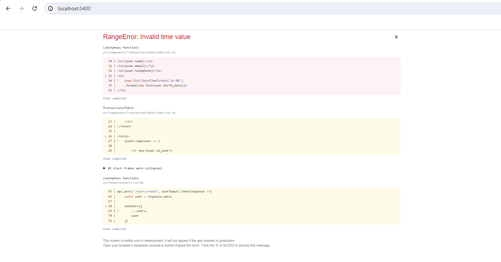

1 - Document Objectives
2 - Product Scope
3 - System Requirements
4 - Acceptance Criteria
5 - Test Cases
6 - Test Case Results
7 - Non-conformities
8 - Improvements

###### 1- Document Objectives
This document aims to identify the software components and requirements to be tested in the Contato Seguro CRUD project. In addition to identifying the system requirements, it will present the definition of acceptance criteria, detailed test cases, documentation, review of test cases, execution, and recording of test cases.

###### 2- Product Scope
The Contato Seguro system will be subject to integration tests, functional tests, and end-to-end tests, where the Database, Front-End, and Back-End will be validated. In integration tests, API tests will be validated using the Postman framework, while end-to-end validations will be validated through automation in Cypress.

###### 3- System Requirements
- The system must allow the creation of new users with the mandatory fields: Nome, Email, Telefone, Data and Empresas. 
- The system must validate the formats in the fields Email, Telefone, Data. 
- The system must ensure that the Email and Telefone are unique. 
- The system must allow the viewing, updating, and deletion of users registered on the platform.

###### 4- Acceptance Criteria

- Successful registration: The user is successfully registered and a confirmation message is displayed.
- Successful registration with multiple companies: The user is successfully registered with multiple companies and a confirmation message is displayed.
- Name not filled in: The system displays an error message indicating that the name is required.
- Email not filled in: The system displays an error message indicating that the email is required.
- Invalid email format: The system displays an error message indicating that the email format is invalid.
- Duplicate email: The system displays an error message indicating that the email is already in use.
- Duplicate phone: The system displays an error message indicating that the phone is already in use.
- Phone not filled in: The system displays an error message indicating that the phone is required.
- Invalid phone format: The system displays an error message indicating that the phone format is invalid.
- Date not filled in: The system displays an error message indicating that the date is required.
- Future date: The system displays an error message indicating that the date is not valid.
- Company not selected: The system displays an error message indicating that the company is required.
- View created user: The user details are correctly displayed.
- Update user without name: The system displays an error message indicating that the name is required.
- Update user without email: The system displays an error message indicating that the email is required.
- Update user with invalid email format: The system displays an error message indicating that the email format is invalid.
- Update user with duplicate email: The system displays an error message indicating that the email is already in use.
- Update user without phone: The system displays an error message indicating that the phone is required.
- Update user with invalid phone: The system displays an error message indicating that the phone format is invalid.
- Update user without date: The system displays an error message indicating that the date is required.
- Update user without company: The system displays an error message indicating that the company is required.
- Delete user registration: The registration is successfully removed and a confirmation message is displayed.
- Successfully create a new user via API: The user is successfully created via API and a success message is displayed.
- Create new user via API Bad Request: The user is not created and a Bad Request error message is returned from the API.
- Successfully view a user by ID via API: The API returns the data of the user searched by ID and a success message is displayed.
- View a user by ID via API Bad Request: The user cannot be viewed and a Bad Request error message is returned from the API.
- Successfully view all users via API: The API returns the data of all users and a success message is displayed.
- Successfully update a user via API: The API updates the user data and a success message is displayed.
- Update user via API Bad Request: The user cannot be updated and a Bad Request error message is returned from the API.
- Successfullly delete a user via API: The API deletes the user data and a success message is displayed.
- Successfully create a company via API: The company is successfully created via API and a success message is displayed.
- Create company via API Bad Request: The company cannot be created and a Bad Request error message is returned from the API.
- Successfully view all companies via API: The API returns the data of all companies and a success message is displayed.
- Successfully view a company by ID via API: The API returns the data of the company searched by ID and a success message is displayed.
- View a company by ID API Bad Request: The API does not return the company data and displays a Bad Request message.
- Successfully update a company via API: The API updates the company data and a success message is displayed.
- Update company via API Bad Request: The API does not update the company data and displays a Bad Request message.
- Successfully delete a company via API: The API deletes the company data and a success message is displayed.
- Delete company via API Bad Request: The API does not delete the company data and a Bad Request message is returned.

###### 5- Test Cases

User Story:
As an administrator of the Contato Seguro system
I want to manage user accounts
So that I can ensure user information is up-to-date for the companies

Feature: Register User

#1 Scenario: Successful User Registration
    Given the administrator is on the main page of the Contato Seguro system
    And selects the "+Novo Usuário " button
    When they fill in the "Nome" field with a valid name
    And they fill in the "E-mail" field with a valid email
    And they fill in the "Telefone" field with an area code and number
    And they fill in the "Data" field with a valid date
    And they select the desired company in the "Empresas" field
    And they click the modal to close the dropdown menu
    And they select the "Salvar" button
    Then it should be possible to view the registered user on the main page

#2 Scenario: Successful User Registration multiple Companies
    Given the administrator is on the main page of the Contato Seguro system
    And selects the "+Novo Usuário " button
    When they fill in the "Nome" field with a valid name
    And they fill in the "E-mail" field with a valid email
    And they fill in the "Telefone" field with an area code and number
    And they fill in the "Data" field with a valid date
    And they select the desired company in the "Empresas" field
    And they select another company in the "Empresas" field
    And they click the modal to close the dropdown menu
    And they select the "Salvar" button
    Then it should be possible to view the registered user on the main page

#3 Scenario: Name Not Filled In
    Given the administrator is on the main page of the Contato Seguro system
    And they select the "+Novo Usuário" button
    When they leave the "Nome" field empty
    And they fill in the "E-mail" field with a valid email
    And they fill in the "Telefone" field with an area code and number
    And they fill in the "Data" field with a valid date
    And they select the desired company in the "Empresas" field
    And they click the modal to close the dropdown menu
    And they select the "Salvar" button
    Then the system should alert the mandatory "Nome" field
    And display a message requesting the empty field to be filled in

#4 Scenario: Email Not Filled In
    Given the administrator is on the main page of the Contato Seguro system
    And they select the "+Novo Usuário" button
    When they fill in the "Nome" field with a valid name
    And they leave the "E-mail" field empty
    And they fill in the "Telefone" field with an area code and number
    And they fill in the "Data" field with a valid date
    And they select the desired company in the "Empresas" field
    And they click the modal to close the dropdown menu
    And they select the "Salvar" button
    Then the system should alert the mandatory "E-mail" field
    And display a message requesting the empty field to be filled in

#5 Scenario: Invalid Email Format
    Given the administrator is on the main page of the Contato Seguro system
    And they select the "+Novo Usuário" button
    When they fill in the "Nome" field with a valid name
    And they fill in the "E-mail" field with an invalid format
    And they fill in the "Telefone" field with an area code and number
    And they fill in the "Data" field with a valid date
    And they select the desired company in the "Empresas" field
    And they click the modal to close the dropdown menu
    And they select the "Salvar" button
    Then the system should alert an error about the value in the "E-mail" field
    And display a message requesting the field to be filled in with a correct value

#6 Scenario: Duplicate Email
    Given the administrator is on the main page of the Contato Seguro system
    And they select the "+Novo Usuário" button
    When they fill in the "Nome" field with a valid name
    And they fill in the "E-mail" field with a previously registered email
    And they fill in the "Telefone" field with an area code and number
    And they fill in the "Data" field with a valid date
    And they select the desired company in the "Empresas" field
    And they click the modal to close the dropdown menu
    And they select the "Salvar" button
    Then the system should alert an error about the value in the "E-mail" field
    And display a message requesting the field to be changed to a correct value

#7 Scenario: Phone Number Not Filled In
    Given the administrator is on the main page of the Contato Seguro system
    And they select the "+Novo Usuário" button
    When they fill in the "Nome" field with a valid name
    And they fill in the "E-mail" field with a valid email
    And they leave the "Telefone" field empty
    And they fill in the "Data" field with a valid date
    And they select the desired company in the "Empresas" field
    And they click the modal to close the dropdown menu
    And they select the "Salvar" button
    Then the system should alert the mandatory "Telefone" field
    And display a message requesting the empty field to be filled in

#8 Scenario: Invalid Phone Number Format
    Given the administrator is on the main page of the Contato Seguro system
    And they select the "+Novo Usuário" button
    When they fill in the "Nome" field with a valid name
    And they fill in the "E-mail" field with a valid email
    And they fill in the "Telefone" field with an invalid format
    And they fill in the "Data" field with a valid date
    And they select the desired company in the "Empresas" field
    And they click the modal to close the dropdown menu
    And they select the "Salvar" button
    Then the system should alert an error about the value in the "Telefone" field
    And display a message requesting the field to be changed to a correct value

#9 Scenario: Duplicate Phone Number
    Given the administrator is on the main page of the Contato Seguro system
    And they select the "+Novo Usuário" button
    When they fill in the "Nome" field with a valid name
    And they fill in the "E-mail" field with a valid email
    And they fill in the "Telefone" field with a previously registered phone number
    And they fill in the "Data" field with a valid date
    And they select the desired company in the "Empresas" field
    And they click the modal to close the dropdown menu
    And they select the "Salvar" button
    Then the system should alert an error about the value in the "Telefone" field
    And display a message requesting the field to be changed to a correct value

#10 Scenario: Date Not Filled In
    Given the administrator is on the main page of the Contato Seguro system
    And they select the "+Novo Usuário" button
    When they fill in the "Nome" field with a valid name
    And they fill in the "E-mail" field with a valid email
    And they fill in the "Telefone" field with an area code and number
    And they leave the "Data" field empty
    And they select the desired company in the "Empresas" field
    And they click the modal to close the dropdown menu
    And they select the "Salvar" button
    Then the system should alert the mandatory "Data" field
    And display a message requesting the empty field to be filled in

#11 Scenario: Future Date
    Given the administrator is on the main page of the Contato Seguro system
    And they select the "+Novo Usuário" button
    When they fill in the "Nome" field with a valid name
    And they fill in the "E-mail" field with a valid email
    And they fill in the "Telefone" field with an area code and number
    And they fill in the "Data" field with a future date
    And they select the desired company in the "Empresas" field
    And they click the modal to close the dropdown menu
    And they select the "Salvar" button
    Then the system should alert an error about the value in the "Data" field
    And display a message requesting the field to be changed to a correct value

#12 Scenario: Invalid Date Format
    Given the administrator is on the main page of the Contato Seguro system
    And they select the "+Novo Usuário" button
    When they fill in the "Nome" field with a valid name
    And they fill in the "E-mail" field with a valid email
    And they fill in the "Telefone" field with an area code and number
    And they fill in the "Data" field with an invalid format
    And they select the desired company in the "Empresas" field
    And they click the modal to close the dropdown menu
    And they select the "Salvar" button
    Then the system should alert an error about the value in the "Data" field
    And display a message requesting the field to be changed to a correct value

#13 Scenario: Company Not Selected
    Given the administrator is on the main page of the Contato Seguro system
    And they select the "+Novo Usuário" button
    When they fill in the "Nome" field with a valid name
    And they fill in the "E-mail" field with a valid email
    And they fill in the "Telefone" field with an area code and number
    And they fill in the "Data" field with a valid date
    And they leave the "Empresas" field empty
    And they click the modal to close the dropdown menu
    And they select the "Salvar" button
    Then the system should alert the mandatory "Empresas" field
    And display a message requesting the empty field to be filled in

Feature: View User

#14 Scenario: View Created User
    Given the administrator is on the main page of the Contato Seguro system
    And they view the list of users
    Then it should be possible to view the data of the registered user

Feature: Update User

#15 Scenario: User Update
    Given the administrator is on the main page of the Contato Seguro system
    And they select the "Editar Usuário" button
    When they change the "Nome" field to a valid name
    And they change the "E-mail" field to a valid email
    And they change the "Telefone" field to an area code and number
    And they change the "Data" field to a valid date
    And they change the "Empresas" field to a valid company
    And they select the "Salvar" button
    Then it should be possible to view the updated user on the main page

#16 Scenario: User Update Without Name
    Given the administrator is on the main page of the Contato Seguro system
    And they select the "Editar Usuário" button
    When they change the "Nome" field to an empty value
    And they change the "E-mail" field to a valid email
    And they change the "Telefone" field to an area code and number
    And they change the "Data" field to a valid date
    And they change the "Empresas" field to a valid company
    And they select the "Salvar" button
    Then the system should alert the mandatory "Nome" field
    And display a message requesting the empty field to be filled in

#17 Scenario: User Update Without Email
    Given the administrator is on the main page of the Contato Seguro system
    And they select the "Editar Usuário" button
    When they change the "Nome" field to a valid name
    And they change the "E-mail" field to an empty value
    And they change the "Telefone" field to an area code and number
    And they change the "Data" field to a valid date
    And they change the "Empresas" field to a valid company
    And they select the "Salvar" button
    Then the system should alert the mandatory "E-mail" field
    And display a message requesting the empty field to be filled in

#18 Scenario: User Update With Duplicate Email
    Given the administrator is on the main page of the Contato Seguro system
    And they select the "Editar Usuário" button
    When they change the "Nome" field to a valid name
    And they change the "E-mail" field to a previously registered email
    And they change the "Telefone" field to an area code and number
    And they change the "Data" field to a valid date
    And they change the "Empresas" field to a valid company
    And they select the "Salvar" button
    Then the system should alert about the duplicate entry in the "E-mail" field
    And display a message requesting the field to be changed to a unique value

#19 Scenario: User Update Without Phone Number
    Given the administrator is on the main page of the Contato Seguro system
    And they select the "Editar Usuário" button
    When they change the "Nome" field to a valid name
    And they change the "E-mail" field to a valid email
    And they change the "Telefone" field to an empty value
    And they change the "Data" field to a valid date
    And they change the "Empresas" field to a valid company
    And they select the "Salvar" button
    Then the system should alert the mandatory "Telefone" field
    And display a message requesting the empty field to be filled in

#20 Scenario: User Update With Invalid Phone Number Format
    Given the administrator is on the main page of the Contato Seguro system
    And they select the "Editar Usuário" button
    When they change the "Nome" field to a valid name
    And they change the "E-mail" field to a valid email
    And they change the "Telefone" field to an invalid format
    And they change the "Data" field to a valid date
    And they change the "Empresas" field to a valid company
    And they select the "Salvar" button
    Then the system should alert an error about the value in the "Telefone" field
    And display a message requesting the field to be changed to a correct value

#21 Scenario: User Update Without Date
    Given the administrator is on the main page of the Contato Seguro system
    And they select the "Editar Usuário" button
    When they change the "Nome" field to a valid name
    And they change the "E-mail" field to a valid email
    And they change the "Telefone" field to an area code and number
    And they change the "Data" field to an empty value
    And they change the "Empresas" field to a valid company
    And they select the "Salvar" button
    Then the system should alert the mandatory "Data" field
    And display a message requesting the empty field to be filled in

#22 Scenario: User Update Without Company
    Given the administrator is on the main page of the Contato Seguro system
    And they select the "Editar Usuário" button
    When they change the "Nome" field to a valid name
    And they change the "E-mail" field to a valid email
    And they change the "Telefone" field to an area code and number
    And they change the "Data" field to a valid date
    And they change the "Empresas" field to an empty value
    And they select the "Salvar" button
    Then the system should alert the mandatory "Empresas" field
    And display a message requesting the empty field to be filled in

Feature: Delete User

#23 Scenario: Delete User Registration
    Given the administrator is on the main page of the Contato Seguro system
    And they select the "Excluir" button for the user
    Then the system should alert the successful deletion
    And display a message stating "Success! User deleted successfully!"

#API User
Feature: Create a new user via API

#24 Scenario: Successfully create a new user
    Given the API endpoint 'http://localhost:8400/api/user/create' is available
    When a POST request is sent to the endpoint with the following JSON payload:
      """
      {
        "name": "<nome>",
        "email": "<email>",
        "companies": ["<company.id>"],
        "telephone": "<telephone>"
        "birth_date": "<yyyy/mm/dd>"
      }
      """
    And the request header 'Content-Type' is set to 'application/json'
    Then the response status code should be 201
    And the response body should contain the user's details with "name" as "<name>", "email" as "<email>", "companies" containing "<company.id>", "telephone" containing "<telephone>" and "birth_date" containing "<yyyy/mm/dd>"

#Examples:
        | nome                | email                       |company.id | telephone    | birth date
        | Lucas Engelmann     | lucasengelman@email.com     | 1         | 51985696919  | 1998/01/01
        | João Silva          | joaosilva@email.com         | 4         | 11999182121  | 2000/07/03

#25 Scenario: Create new user via API Bad Request
    Given the API endpoint 'http://localhost:8400/api/user/create' is available
    When a POST request is sent to the endpoint with the following JSON payload:
      """
      {
        "name": "<nome>",
        "email": "<email>",
        "telephone": "<telephone>"
        "birth_date": "<yyyy/mm/dd>"
      }
      """
    And the request header 'Content-Type' is set to 'application/json'
    Then the response status code should be 400
    And the response body should contain a message explaining "{"message": "invalid data!"}"

#Examples:
        | nome                | email                       | telephone    | birth date
        | Lucas Engelmann     | lucasengelman@email.com     | 51985696919  | 1998/01/01
        | João Silva          | joaosilva@email.com         | 11999182121  | 2000/07/03
        

#26 Scenario: Successfully retrieve all users
    Given the API endpoint 'http://localhost:8400/api/user' is available
    When a GET request is sent to the endpoint
    Then the response status code should be 200 with the user data
    And the response body should contain a list of users
    And each user in the list should have the fields "id_user", "name", "email", "telephone", "birth_date", "birth_city", "show" and "companies"

Feature: Retrieve a user by ID via API

#27 Scenario: Successfully retrieve a user by ID
    Given the API endpoint 'http://localhost:8400/api/user/{id}' is available
    And a user with ID "<id_user>" exists in the system
    When a GET request is sent to the endpoint with the user ID "<id_user>"
    Then the response status code should be 200
    And the response body should contain the user's details with "id" as "<id_user>"

#Examples: after retrieving all users, if a user has an id_user as:
    | id_user |
    | 33      |    

#28 Scenario: View a user by ID via API Bad Request
    Given the API endpoint 'http://localhost:8400/api/user/{id}' is available
    And a user with ID "<id_user>" exists in the system
    When a GET request is sent to the endpoint with the user ID "<id_user>"
    Then the response status code should be 400
    And the response body should contain a message explaining "{"message": "invalid data!"}"

#Examples: after retrieving all users, if using a non-existing id:
    | id_user |
    | 00      | 

Feature: Update a user via API

#29 Scenario: Successfully update a user
    Given the API endpoint 'http://localhost:8400/api/user/{id}/update' is available
    And a user with ID "<id_user>" exists in the system
    When a PATCH request is sent to the endpoint with the user ID "<id_user>" and the following JSON payload:
      """
      {
        "name": "<nome>",
        "email": "<email>",
        "companies": ["<company.id>"]
      }
      """
    And the request header 'Content-Type' is set to 'application/json'
    Then the response status code should be 200: Updated user data
    And the response body should contain the updated user's details with "name" as "<nome>", "email" as ""<email>", and "companies" containing ["<company.id>"]

#Examples:
 http://localhost:8400/api/user/33/update
    |name            | email                    |company.id
    |Lucas Engelmann | lucasengelman@gmail.com  | 4

#30 Scenario: Update user via API Bad Request
    Given the API endpoint 'http://localhost:8400/api/user/{<id_user>}/update' is available
    And a user with ID "<id_user>" exists in the system
    When a PATCH request is sent to the endpoint with the user ID "<id_user>" and the following JSON payload:
      """
      {
        "name": "<nome>",
        "email": "<email>",
        "companies": ["null"]
      }
      """
    And the request header 'Content-Type' is set to 'application/json'
    Then the response status code should be 400: Bad Request

    #Examples:
 http://localhost:8400/api/user/33/update
    |name            | email                    |company.id | id_user
    |Lucas Engelmann | lucasengelman@gmail.com  | null      | 33

#31 Scenario: Successfully delete a user
    Given the API endpoint 'http://localhost:8400/api/user/{id_user}/delete' is available
    And a user with ID "<id_user>" does not exist in the system
    When a DELETE request is sent to the endpoint with the user ID "<id_user>"
    Then the user should be successfully deleted
    And the response status should be 200
    And the response message should be "data deleted successfully!"

#32 Scenario: Delete user not found
Given the API endpoint 'http://localhost:8400/api/user/{id_user}/delete' is available
    And a user with ID "<id_user>" exists in the system
    When a DELETE request is sent to the endpoint with the user ID "<id_user>"
    Then the user should not be found
    And the response status should be 404
    And the response message should be "unable to delete data!"

#API Company

Feature: Create a new company via API

#31 Scenario: Successfully create a new company
    Given the API endpoint 'http://localhost:8400/api/company/create' is available
    When a POST request is sent to the endpoint with the following JSON payload:
      """
      {
    "name": "Teste Empresa",
    "cnpj": "71963761000197",
    "adress": {
        "cep": "01310200",
        "country": "Brazil",
        "city": "São Paulo",
        "state": "São Paulo",
        "street": "Avenida Paulista",
        "number": "1234",
        "district": "Bela Vista"
    }
}
      """
    And the request header 'Content-Type' is set to 'application/json'
    Then the response status code should be 201: Created company data
    And the response body should contain the company's details with "name" as "Teste Empresa", "cnpj" as "71963761000197", and "adress"
    And each "adress" should contain "cep" as "01310-200", "country" as "Brazil", "city" as "São Paulo", "street" "Avenida Paulista", "number" as "1234", and "district" as "Bela Vista"

Feature: Retrieve all companies via API

#29 Scenario: Successfully retrieve all companies
    Given the API endpoint 'http://localhost:8400/api/company' is available
    When a GET request is sent to the endpoint
    Then the response status code should be 200
    And the response body should contain a list of companies
    And each company in the list should have the fields "id", "name", "cnpj", and "adress"
    And each "adress" should contain "cep", "country", "city", "street", "number", and "district"

Feature: Retrieve a company by ID via API

#30 Scenario: Successfully retrieve a company by ID
    Given the API endpoint 'http://localhost:8400/api/company/{id}' is available
    And a company with ID "123" exists in the system
    When a GET request is sent to the endpoint with the company ID "123"
    Then the response status code should be 200 with the company data
    And the response body should contain the company's details with "id" as "123", "name", "cnpj", and "adress"
    And the "adress" should contain "cep", "country", "city", "street", "number", and "district"

Feature: Update a company via API

#31 Scenario: Successfully update a company
    Given the API endpoint 'http://localhost:8400/api/company/{id}/update' is available
    And a company with ID "123" exists in the system
    When a PATCH request is sent to the endpoint with the company ID "123" and the following JSON payload:
      """
      {
        "name": "string",
        "cnpj": "string",
        "adress": {
          "cep": "string",
          "country": "string",
          "state": "string",
          "city": "string",
          "street": "string",
          "number": "string",
          "district": "string"
        }
      }
      """
    And the request header 'Content-Type' is set to 'application/json'
    Then the response status code should be 200: Updated company data
    And the response body should contain the updated company's details with "name" as "string", "cnpj" as "string", and "adress" containing "cep", "country", "state", "city", "street", "number", and "district"

###### 6- Test Case Results

Feature: Register user

Test Case ID: CT0001
Title: Successful User registration
Description: Validate if a new user can be successfully registered in the system.
Pre-condition: The system must be accessible and the registration page must be open.
Steps:
    Given that the administrator is on the main page of the Contato Seguro system
    And selects the "+Novo Usuário" button
    When filling in the "Nome" field with a valid name
    And filling in the "E-mail" field with a valid email
    And filling in the "Telefone" field with a DDD and number
    And filling in the "Data" field with a valid date
    And selecting the desired company in the "Empresas" field
    And clicking the modal to close the dropdown menu
    And selecting the "Salvar" button
Expected result: Then it should be possible to view the registered user on the main page.
Post-condition: The new user should be available for consultation on the main page.
Method used: Automated test via Cypress
Actual result: Registration successfully completed 

Test Case ID: CT0002
Title: Successful registration with multiple companies
Description: Validate if a new user can be successfully registered in the system using multiple companies.
Pre-condition: The system must be accessible and the registration page must be open.
Steps:
    Given that the administrator is on the main page of the Contato Seguro system
    And selects the "+Novo Usuário" button
    When filling in the "Nome" field with a valid name
    And filling in the "E-mail" field with a valid email
    And filling in the "Telefone" field with a DDD and number
    And filling in the "Data" field with a valid date
    And selecting the desired company in the "Empresas" field
    And selecting another company in the "Empresas" field
    And clicking the modal to close the dropdown menu
    And selecting the "Salvar" button
Expected result: 
    Then it should be possible to view the registered user on the main page.
Post-condition: The new user should be available for consultation on the main page.
Method used: Automated test via Cypress
Actual result: Registration successfully completed 

Test Case ID: CT0003
Title: Nome not filled
Description: Validate if a user can be registered without filling in the required "Nome" field.
Pre-condition: The system must be accessible and the registration page must be open.
Steps:
    Given that the administrator is on the main page of the Contato Seguro system
    And selects the "+Novo Usuário" button
    When the "Nome" field is left empty
    And filling in the "E-mail" field with a valid email
    And filling in the "Telefone" field with a DDD and number
    And filling in the "Data" field with a valid date
    And selecting the desired company in the "Empresas" field
    And clicking the modal to close the dropdown menu
    And selecting the "Salvar" button
Expected result:
    Then the system should alert the mandatory "Nome" field
    And present a message requesting the completion of the empty field.
Post-condition: It should not be possible to register the new user.
Method used: Automated test via Cypress
Actual result: System alerted the need to fill the mandatory "Nome" field and presented a message requesting its completion 

Test Case ID: CT0004
Title: E-mail not filled
Description: Validate if a user can be registered without filling in the required "E-mail" field.
Pre-condition: The system must be accessible and the registration page must be open.
Steps:
    Given that the administrator is on the main page of the Contato Seguro system
    And selects the "+Novo Usuário" button
    When filling in the "Nome" field with a valid name
    And leaving the "E-mail" field empty
    And filling in the "Telefone" field with a DDD and number
    And filling in the "Data" field with a valid date
    And selecting the desired company in the "Empresas" field
    And clicking the modal to close the dropdown menu
    And selecting the "Salvar" button
Expected result:
    Then the system should alert the mandatory "E-mail" field
    And present a message requesting the completion of the empty field.
Post-condition: It should not be possible to register the new user.
Method used: Automated test via Cypress
Actual result: System alerted the need to fill the mandatory "Email" field and presented a message requesting its completion 

Test Case ID: CT0005
Title: Invalid Email Format
Description: Validate if a user can be registered with an incorrectly formatted "E-mail" field.
Pre-condition: The system must be accessible, and the registration page must be open.
Steps:
    Given that the administrator is on the main page of the Contato Seguro system
    And selects the "+ Novo Usuário" button
    When filling the "Nome" field with a valid name
    And fills the "E-mail" field with an invalid format
    And fills the "Telefone" field with a valid phone number
    And fills the "Data" field with a valid date
    And selects the desired company in the "Empresas" field
    And clicks on the modal to close the dropdown menu
    And selects the "Salvar" button
Expected Result:
    Then the system should alert an error regarding the value in the "E-mail" field
    And present a message requesting the correct value to be entered in the field.
Post-condition: It should not be possible to register the new user.
Actual Result: The test could not be automated due to the absence of an email format validation rule in the code, as it accepts any string without verifying the entered format.

Test Case ID: CT0006
Title: Duplicate Email
Description: Validate if a user can be registered with an email that has been previously used.
Pre-condition: Have a user previously created with the email used.
Steps:
    Given that the administrator is on the main page of the Contato Seguro system
    And selects the "+ Novo Usuário" button
    When filling the "Nome" field with a valid name
    And fills the "E-mail" field with a previously registered email
    And fills the "Telefone" field with a valid phone number
    And fills the "Data" field with a valid date
    And selects the desired company in the "Empresas" field
    And clicks on the modal to close the dropdown menu
    And selects the "Salvar" button
Expected Result:
    Then the system should alert an error regarding the value in the "E-mail" field
    And present a message requesting the change of the field with the correct value.
Post-condition: It should not be possible to register the new user.
Actual Result: The test could not be automated due to the absence of a validation rule for registered emails in the system, as it accepts any string without verifying the format entered.

Test Case ID: CT0007
Title: Telefone not filled
Description: Validate if a user can be registered without filling in the required "Telefone" field.
Pre-condition: The system must be accessible and the registration page must be open.
Steps:
    Given that the administrator is on the main page of the Contato Seguro system
    And selects the "+ Novo Usuário" button
    When filling in the "Nome" field with a valid name
    And filling in the "E-mail" field with a valid email
    And leaving the "Telefone" field empty
    And filling in the "Data" field with a valid date
    And selecting the desired company in the "Empresas" field
    And clicking the modal to close the dropdown menu
    And selecting the "Salvar" button
Expected result:
    Then the system should alert the mandatory "Telefone" field
    And present a message requesting the completion of the empty field.
Post-condition: It should not be possible to register the new user.
Actual result: Bug NCCT0007- The scenario couldn't be automated due to the absence of the 'Telefone' field as a mandatory requirement in the code, despite being documented as mandatory. When attempting to create a new user without providing the phone number, it allows the creation to proceed.

Test Case ID: CT0008
Title: Invalid Phone Number Format
Description: Validate if a user can be registered with an incorrect format in the mandatory field "Phone Number".
Pre-condition: The system must be accessible and the registration page must be open.
Steps:
    Given that the administrator is on the main page of the Contato Seguro system
    And selects the "+ Novo Usuário" button
    When filling the "Nome" field with a valid name
    And fills the "E-mail" field with a valid email
    And fills the "Telefone" field with an invalid format
    And fills the "Data" field with a valid date
    And selects the desired company in the "Empresas" field
    And clicks on the modal to close the dropdown menu
    And selects the "Salvar" button
Expected Result:
    Then the system should alert an error regarding the value in the "Telefone" field
    And present a message requesting the change of the field with the correct value.
Post-condition: It should not be possible to register the new user.
Actual Result: The test could not be executed due to the impact of Bug NCCT0007.

Test Case ID: CT0009
Title: Date not filled
Description: Validate if a user can be registered without filling the mandatory "Data" field.
Pre-condition: The system must be accessible and the registration page must be open.
Steps:
    Given that the administrator is on the main page of the Contato Seguro system
    And selects the "+ Novo Usuário" button
    When filling the "Nome" field with a valid name
    And fills the "E-mail" field with a valid email
    And fills the "Telefone" field with a DDD and number
    And leaves the "Data" field empty
    And selects the desired company in the "Empresas" field
    And clicks on the modal to close the dropdown menu
    And selects the "Salvar" button
Expected Result:
    Then the system should alert the requirement of the "Data" field
    And present a message requesting the completion of the empty field.
    Post-condition: It should not be possible to register the new user.
Method used: Automated test via Cypress
Actual Result: The system alerted the need to fill the mandatory "Data" field and presented a message requesting its completion. 

Test Case ID: CT0010
Title: Future Date
Description: Validate if a user can be registered with a future date.
Pre-condition: The system must be accessible and the registration page must be open.
Steps:
    Given that the administrator is on the main page of the Contato Seguro system
    And selects the "+ Novo Usuário" button
    When filling the "Nome" field with a valid name
    And fills the "E-mail" field with a valid email
    And fills the "Telefone" field with a DDD and number
    And fills the "Data" field with a future date
    And selects the desired company in the "Empresas" field
    And clicks on the modal to close the dropdown menu
    And selects the "Salvar" button
Expected Result:
    Then the system should alert an error regarding the value in the "Data" field
    And present a message requesting the correction of the field with the correct value.
Post-condition: It should not be possible to register the new user.
Actual Result: It was not possible to automate the test due to the absence of a validation rule preventing the registration of a user using a future date. Manually it was identified that when registering the user using a future date, the application started to break, signaling the error "RangeError: Invalid time value."  

Test Case ID: CT0011
Title: Company not filled
Description: Validate if a user can be registered without filling the mandatory "Empresas" field.
Pre-condition: The system must be accessible and the registration page must be open.
Steps:
    Given that the administrator is on the main page of the Contato Seguro system
    And selects the "+ Novo Usuário" button
    When filling the "Nome" field with a valid name
    And fills the "E-mail" field with a valid email
    And fills the "Telefone" field with a DDD and number
    And fills the "Data" field with a valid date
    And leaves the "Empresas" field empty
    And selects the "Salvar" button
Expected Result:
    Then the system should alert the requirement for the "Empresas" field
    And present a message requesting the completion of the empty field.
Post-condition: It should not be possible to register the new user.
Método utilizado: Automated test via Cypress
Actual result: The system alerted the need to fill the mandatory "Empresas" field and presented a message requesting its completion. "[evidency_CT0011](images/company_not_selected.png)

Functionality: View User

Test Case ID: CT0012
Title: Viewing Created User
Description: Validate reading the data of the created user.
Pre-condition: Have a user created in the database.
Steps:
    Given that the administrator is on the main page of the Contato Seguro system
    And views the list of users
Expected Result:
    Then it should be possible to view the data of the registered user.
Post-condition: The user should be available for inquiry.
Actual result: Scenario validated in CT0001

Funcionalidade: Atualizar usuário

Test Case ID: CT0013
Title: User Update
Description: Validate if user data can be successfully updated.
Pre-condition: Have a user created in the database.
Steps:
    Given that the administrator is on the main page of the Contato Seguro system
    And selects the "Editar Usuário" button
    When changing the "Nome" field to a valid name
    And changing the "E-mail" field to a valid email
    And changing the "Telefone" field to a valid DDD and number
    And changing the "Data" field to a valid date
    And changing the "Empresas" field to a valid company
    And clicks on the modal to close the dropdown menu
    And selects the "Salvar" button
Expected Result:
    Then it should be possible to view the updated user on the initial page.
Post-condition: The user should be available for inquiry.
Actual result: Bug NCCT0013 - The "Editar Usuário" button does not perform any action after interacting with it. It was not possible to automate the scenario due to bug NCCT0013.

Test Case ID: CT0014
Title: Update user without Name
Description: Validate if a user can be updated without filling in the mandatory "Nome" field.
Pre-condition: Have a user created in the database.
Steps:
    Given that the administrator is on the main page of the Contato Seguro system
    And selects the "Editar Usuário" button
    When changing the "Nome" field to an empty value
    And changing the "E-mail" field to a valid email
    And changing the "Telefone" field to a valid DDD and number
    And changing the "Data" field to a valid date
    And changing the "Empresas" field to a valid company
    And clicks on the modal to close the dropdown menu
    And selects the "Salvar" button
Expected Result:
    Then the system should alert the requirement for the "Nome" field
    And present a message requesting the completion of the empty field.
Post-condition: It should not be possible to update changes to the user.
Actual result: It was not possible to automate the scenario due to bug NCCT0013.

Test Case ID: CT0015
Title: Update user without Email
Description: Validate if a user can be updated without filling in the mandatory "E-mail" field.
Pre-condition: Have a user created in the database.
Steps:
    Given that the administrator is on the main page of the Contato Seguro system
    And selects the "Editar Usuário" button
    When changing the "Nome" field to a valid name
    And changing the "E-mail" field to an empty value
    And changing the "Telefone" field to a valid DDD and number
    And changing the "Data" field to a valid date
    And changing the "Empresas" field to a valid company
    And clicks on the modal to close the dropdown menu
    And selects the "Salvar" button
Expected Result:
    Then the system should alert the requirement for the "E-mail" field
    And present a message requesting the completion of the empty field.
Post-condition: It should not be possible to update changes to the user.
Actual Result: It was not possible to automate the scenario due to bug NCCT0013.

Test Case ID: CT0016
Title: Update user with Invalid Email Format
Description: Validate if a user can be updated with an incorrect format filled in the mandatory "E-mail" field.
Pre-condition: Have a user created in the database.
Steps:
    Given that the administrator is on the main page of the Contato Seguro system
    And selects the "Editar Usuário" button
    When changing the "Nome" field to a valid name
    And changing the "E-mail" field to an invalid format
    And changing the "Telefone" field to a valid DDD and number
    And changing the "Data" field to a valid date
    And changing the "Empresas" field to a valid company
    And clicks on the modal to close the dropdown menu
    And selects the "Salvar" button
Expected Result:
    Then the system should alert an error regarding the value in the "E-mail" field
    And present a message requesting the completion of the field with correct value.
Post-condition: It should not be possible to update changes to the user.
Actual Result: It was not possible to automate the scenario due to bug NCCT0013 and the absence of an email format validation rule in the code as in CT0005.

Test Case ID: CT0017
Title: Update user with Duplicate Email
Description: Validate if a user can be updated with an email that has been previously used.
Pre-condition: Have a user created in the database and a user with the email to be used.
Steps:
    Given that the administrator is on the main page of the Contato Seguro system
    And selects the "Editar Usuário" button
    When changing the "Nome" field to a valid name
    And changing the "E-mail" field to a value previously registered
    And changing the "Telefone" field to a valid DDD and number
    And changing the "Data" field to a valid date
    And changing the "Empresas" field to a valid company
    And clicks on the modal to close the dropdown menu
    And selects the "Salvar" button
Expected Result:
    Then the system should alert about the duplication of the "E-mail" field registration
    And present a message requesting the change of the field with the previously registered value.
Post-condition: It should not be possible to view changes to the user.
Actual Result: It was not possible to automate the scenario due to bug NCCT0013 and absence of an email format validation rule in the code as in CT0006.

Test Case ID: CT0018
Title: Update user without Phone Number
Description: Validate if a user can be updated without filling in the mandatory "Telefone" field.
Pre-condition: Have a user created in the database.
Steps:
    Given that the administrator is on the main page of the Contato Seguro system
    And selects the "Editar Usuário" button
    When changing the "Nome" field to a valid name
    And changing the "E-mail" field to a valid email
    And changing the "Telefone" field to an empty value
    And changing the "Data" field to a valid date
    And changing the "Empresas" field to a valid company
    And clicks on the modal to close the dropdown menu
    And selects the "Salvar" button
Expected Result:
    Then the system should alert about the requirement of the "Telefone" field
    And present a message requesting the filling of the empty field.
Post-condition: It should not be possible to view changes to the user.
Actual result: It was not possible to automate the scenario due to bug NCCT0007 and NCCT0013.

Test Case ID: CT0019
Title: Update user with Invalid Phone Number
Description: Validate if a user can be updated with incorrect format filled in the mandatory "Telefone" field.
Pre-condition: Have a user created in the database.
Steps:
    Given that the administrator is on the main page of the Contato Seguro system
    And selects the "Editar Usuário" button
    When changing the "Nome" field to a valid name
    And changing the "E-mail" field to a valid email
    And changing the "Telefone" field to an invalid value
    And changing the "Data" field to a valid date
    And changing the "Empresas" field to a valid company
    And clicks on the modal to close the dropdown menu
    And selects the "Salvar" button
Expected Result:
    Then the system should alert an error about the value in the "Telefone" field
    And present a message requesting the correction of the field with the correct value.
Post-condition: It should not be possible to view changes to the user.
Actual result: It was not possible to automate the scenario due to bug NCCT0007 and NCCT0013.

Test Case ID: CT0020
Title: Update user without Date
Description: Validate if a user can be updated without filling in the mandatory "Data" field.
Pre-condition: Have a user created in the database.
Steps:
    Given that the administrator is on the main page of the Contato Seguro system
    And selects the "Editar Usuário" button
    When changing the "Nome" field to a valid name
    And changing the "E-mail" field to a valid email
    And changing the "Telefone" field to a valid value
    And changing the "Data" field to an empty value
    And changing the "Empresas" field to a valid company
    And clicks on the modal to close the dropdown menu
    And selects the "Salvar" button
Expected Result:
    Then the system should alert the requirement of the "Data" field
    And present a message requesting the filling of the empty field.
Postcondition: It should not be possible to view changes to the user.
Actual result: It was not possible to automate the scenario due to the bug NCCT0013.

Test Case ID: CT0021
Title: Update user without Company
Description: Validate if a user can be updated without filling the mandatory "Empresas" field.
Pre-condition: Have a user created in the database.
Steps:
    Given that the administrator is on the main page of the Contato Seguro system
    And selects the "Editar Usuário" button
    When changing the "Nome" field to a valid name
    And changing the "E-mail" field to a valid email
    And changing the "Telefone" field to a valid value
    And changing the "Data" field to a valid value
    And changing the "Empresas" field to an empty value
    And selecting the "Salvar" button
Expected Result:
    Then the system should alert about the requirement of the "Empresas" field
    And present a message requesting the completion of the empty field.
Post-condition: It should not be possible to view changes in the user.
Actual Result: It was not possible to automate the scenario due to the bug NCCT0013.

Functionality: Delete User

Test Case ID: CT0022
Title: Delete User
Description: Validate if the administrator can delete a created user.
Pre-condition: Have a user created in the database.
Steps:
    Given that the administrator is on the main page of the Contato Seguro system
    And selects the "Apagar" button of the user
Expected Result:
    Then the system should alert about the successful deletion
    And present a message saying "Sucesso! Usuário deletado com sucesso!"
Post-condition: It should not be possible to view the user in the list of existing users.
Actual result: Bug NCCT0022 - It was not possible to automate the scenario due to defect NCCT0022. When the trash can button is clicked to delete the user, it displays a success pop-up message but still keeps the user in the list of existing users. 

ID do Caso de Teste: CT0023
Título:
Descrição:
Pré-condição:
Passos:
Resultado esperado:
Pós-condição:

ID do Caso de Teste: CT0024
Título:
Descrição:
Pré-condição:
Passos:
Resultado esperado:
Pós-condição:

ID do Caso de Teste:CT0025
Título:
Descrição:
Pré-condição:
Passos:
Resultado esperado:
Pós-condição:

ID do Caso de Teste:CT0026
Título:
Descrição:
Pré-condição:
Passos:
Resultado esperado:
Pós-condição:

ID do Caso de Teste:CT0027
Título:
Descrição:
Pré-condição:
Passos:
Resultado esperado:
Pós-condição:

ID do Caso de Teste:CT0028
Título:
Descrição:
Pré-condição:
Passos:
Resultado esperado:
Pós-condição:

ID do Caso de Teste:CT0029
Título:
Descrição:
Pré-condição:
Passos:
Resultado esperado:
Pós-condição:

ID do Caso de Teste:CT0030
Título:
Descrição:
Pré-condição:
Passos:
Resultado esperado:
Pós-condição: